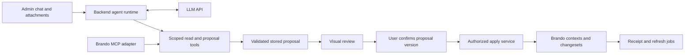

# Admin content agent — proposed scope

Tracking issue: [#2836](https://github.com/brandocms/brando/issues/2836).

Assessment: 19 September 2026. Updated after interface exploration and the
requirement that MCP must never have a network endpoint. Source inspection: Brando `a393e8634`,
BrandoMCP `4d16042`. This is a design proposal, not an implementation or a
production-readiness certification. No model calls or backend runtime tests were made.

Selected interface: **A — Workspace**, extended with an on-demand page preview.

An admin chat can support the requested workflow in development and production:
upload media, describe changes across entries, review a visual proposal, then
approve its application. The main engineering work is reliable content planning
and execution. Token cost is controllable through compact tools and bounded runs.

Recommended first release: use existing block definitions; create entries and
insert/update block instances across a small batch of saved entries. Keep the
proposal separate until confirmation. New entries default to draft; existing
entries preserve publication, with live changes explicitly identified in review.
This publication policy is a recommendation, not yet an accepted product decision.

## The editor's workflow

1. Open **Assistant** from the admin. Show the current site, environment and
   language. An entry's **Build with AI** action can open the same workspace with
   that saved entry selected.
2. Upload five images and two videos through the existing UploadManager, or
   attach existing library assets/folders. Display an attachment tray with
   thumbnails/posters, filenames and stable aliases: `image1`–`image5`,
   `video1`–`video2`. Assign aliases when selected, never by completion order.
3. Ask for the category placements and a Sommerro case. Resolve actual records,
   block fields and allowed modules. Ask targeted questions for ambiguous titles,
   missing required values or unclear placement. Do not invent facts about a case.
4. Build and validate a proposal. Show relevant progress, such as “Found Identity
   and Naming” and “Checking the Case block's media slots.”
5. Review changes grouped by destination entry. Use the actual media and verified
   before/after data to draw the review; the model can supply a short explanation.
   Open **Preview page** to see the proposed content in the site's own template,
   compare it with the saved version and highlight the affected block. Keep the
   conversation visible and make returning to all changes immediate.
6. Refine in chat or approve. Refinements produce a new proposal version and
   invalidate approval of the old one. Cancellation leaves content untouched;
   already uploaded library assets remain available.
7. Apply the approved version. Show a receipt with links to affected entries and
   distinguish content saved from rendering/media processing still in progress.

Illustrative review, assuming these are independent operations and the selected
modules allow the media types:

| Destination | Action | Visual content | Publication effect |
| --- | --- | --- | --- |
| Identity category | Update entry: insert one Case block | `image1` thumbnail, module name, insertion position | Updates the live page if currently published |
| Naming category | Update entry: insert one Case block | `video2` poster, play control, insertion position | Updates the live page if currently published |
| Sommerro case | Create entry | `image2` cover, name, proposed slug and required fields | Creates a draft |

The summary should distinguish **one new entry**, **two updated entries**,
**two inserted blocks**, and **zero deletions**. Entry actions and block actions
are different counts. Display unused attachments as well.

If those category blocks link to the new Sommerro case, the proposal must model
that dependency. A draft case may not have a working public destination: resolve
this by explicitly reviewing publication of the case or deferring its linked
placements. Never silently publish it or imply a draft link will work.

Use a wide review panel alongside chat, with entry cards, real media, compact
block outlines, highlighted insertion points and expandable field differences.
Provide “Adjust”, “Cancel” and an explicit confirmation such as “Apply 3 entry
changes · affects 2 live pages.” Follow [the admin design guide](admin-ui-design.md).
Include page previews in v1 for configured targets, as described below. Review
cards remain available when a content type has no page preview. Arbitrary
model-generated HTML, JavaScript or generated illustrations are unnecessary for
this review UI. Brando components render the structured proposal.

### Page previews inside the workspace

**Preview page** replaces the right-hand overview with a large preview; chat
stays on the left. Entry tabs switch between Identity, Naming and Sommerro.
Provide **Before / Proposed**, desktop/mobile viewport controls, **Show changes**,
**Review fields** and **All changes**. The apply bar continues to describe the
whole batch, including the number of live pages affected. Looking at one page
must not accidentally imply that confirmation applies only that page.

Use Brando's actual frontend layout, template, CSS and media rendering in an
authenticated preview iframe. This is an ordinary Brando preview route, **not an
MCP endpoint**. Keep it private to the authorized admin; public/share preview
links are outside this feature. The checked-in mockup uses an illustrative site
and is labelled accordingly; it demonstrates the interaction, not a real render.

`Brando.LivePreview.initialize/4` already accepts an unsaved changeset, and its
renderer runs the application's configured target. Add a proposal-preview
adapter that materializes the reviewed operations in memory from the canonical
plan. Do not save entries or publish content to obtain a preview. Both field
diffs and page rendering must use the same immutable proposal version that the
user can approve. Rendering, changing viewport and switching entries require no
further LLM calls, though they consume ordinary server resources.

Implementation boundaries:

- Capture the saved baseline used by the proposal. **Before** means that baseline,
  not a potentially stale CDN response. Recheck freshness before rendering and
  applying; changed source content requires a new proposal/review. For a newly
  created entry, Before displays “This page has not been created yet.”
- Begin with the actual Category and Case preview targets. A new case may have
  no database ID; templates, routes and associations must support that state.
  Expose named targets separately from viewport controls where relevant. A
  missing target shows “Page preview is not configured for this content type”
  with the validated field/block review available. A render error should provide
  an honest error and retry, never an invented page screenshot.
- Existing block annotations can locate an inserted/updated block by stable UID
  for scrolling and a removable outline. Keep highlights outside saved content
  and preserve page layout. Keyboard users need access to the scrolling frame;
  changing controls should retain focus. Media requiring new scripts or players
  may need a full iframe reload rather than an HTML patch.
- Use distinct preview cache identities for baseline/proposed, entry, target and
  proposal revision, bound to the actor/site/environment. Clean up both HTML and
  assign caches on expiry, cancellation and version replacement. Preserve fresh
  permission checks and the existing preview ownership rules. Do not reuse an
  editor's preview key or its unsaved form lifecycle.
- Preloads, cached assign callbacks and `mutate_data` have a defined order.
  Materializing one entry does not make staged entries visible to arbitrary
  database queries in a template or assign callback. Where category blocks link
  to the new case, explicitly support proposal-aware reference/assign resolution
  for the chosen targets. Render unsaved relations from the proposal without
  silently reloading persisted values. Do not fabricate IDs or save temporary
  live records. If a dependency cannot be rendered reliably, explain the missing
  preview and retain the structural review; do not claim full batch fidelity.
- Showing a draft case inside an admin preview does not make its future public
  link work. Keep the publication dependency check separate from preview success.

The initial spike must prove the site's actual target/template behavior. General
overlay support for arbitrary cross-entry queries is a larger follow-on; support
the concrete Case/category workflow deliberately rather than promising that all
custom templates will work automatically.

## What is already available

| Foundation | Evidence | Implication |
| --- | --- | --- |
| Provider configuration and usage reporting | `lib/brando/ai.ex` | Reuse configuration; add a conversation/tool runtime. The existing wrapper accepts a text prompt and extracts text, so it is not already an agent loop. |
| Cancellable rich-text proposals | `lib/brando_admin/components/form/rich_text_ai.ex` | Useful interaction precedent; currently specific to one editor input. |
| Shared uploads and asset browser | `docs/UPLOADER.md`, `lib/brando_admin/live/upload_manager.ex` | Uploads can supply real asset IDs; add conversation attachments and delivery routing. |
| Authorization and tenant context | `guides/authorization.md`, `lib/brando/tenant/job.ex` | Bind all work to the current account/site/environment, including background processes. |
| Content-transfer preview/apply | `lib/brando/content/transfer.ex`, `lib/brando/content/transfer/entries.ex` | Existing patterns for validated plans, dependency resolution, freshness checks under locks, receipts and recovery. Extract/reuse focused pieces; an agent proposal is not an import archive. |
| Block construction | `lib/brando_admin/components/form/block_field.ex:build_block/5` | Module defaults, refs, vars, origin and version already have construction logic. Move the reusable part to a domain service. |
| Editor recovery copies | `lib/brando/drafts.ex`, `lib/brando/drafts/entry_draft.ex` | Recovery storage exists, but is user-owned editor recovery, not a complete editorial branching/publishing workflow. |
| Unsaved page rendering and preview authorization | `lib/brando/live_preview.ex`, `lib/brando/authorization/preview.ex` | Reuse configured frontend targets and ownership checks; add proposal materialization/cache isolation, not a second rendering engine. |
| MCP discovery and CRUD | sibling `brando_mcp/lib/brando_mcp/brando.ex` | Compiled Blueprint discovery and generated contexts avoid a second CRUD implementation. |
| MCP seed/translation workflows | sibling `brando_mcp/lib/brando_mcp/{seed,translation,brando}.ex` | Seeds support validation, batch references and transactional insertion; translation adds a source digest. General mixed create/update proposals are still needed. |

[Issue #2666](https://github.com/brandocms/brando/issues/2666) adds site-wide block
guidance, per-entry instructions and selecting images from a folder. Those fit
the same planner. The new request extends it with conversations, mixed media,
multiple destination entries and a common approval step.

## Development and production architecture

Recommended deployment: keep the agent runtime in the Brando application's
backend. It calls the LLM API and executes allowed tools locally, carrying the
authenticated admin scope. BrandoMCP must run in-process, through a local Elixir
adapter or BEAM message passing. Both MCP and admin code use the same content
proposal services. **No MCP URL, HTTP route, listening port, tunnel, proxy route
or externally callable endpoint is permitted, in development or production.**
The browser talks only to the ordinary authenticated Brando admin. The backend
makes outbound LLM API calls and executes returned tool calls locally.

The diagram shows service ownership. The runtime reaches tools through an
in-process adapter; it does not connect to a server URL. Refactor BrandoMCP's
transport-neutral dispatch to accept authenticated scope without relying on
HTTP, global configured users or caller-supplied identity. Its existing HTTP
Plug and standalone listener are not mounted or started for this feature.
If preserving stdio for developer tools, keep it explicitly separate from the
embedded admin runtime. Do not add network exposure as a future convenience.

Application-side tool execution is a supported LLM integration pattern:
[OpenAI function calling](https://developers.openai.com/api/docs/guides/function-calling).
Provider-hosted remote MCP and MCP tunnels are excluded. The LLM receives tool
schemas and compact results through ordinary API requests; it never receives
an address through which it can contact Brando tools directly.

Both dev and prod can use the same application architecture. Production uses
release dependencies and runtime configuration, not `mix brando.mcp` or a dev-only
dependency. Keep API credentials server-side and separate environment budgets.
Dev connects to dev data; production connects to its own scoped content.

### Gaps in the current MCP

- The Plug defaults to loopback connections without an Origin header. Setting
  `allow_remote_access: true` bypasses that check; it does not add authentication.
  Origin filtering is not user authentication. A loopback reverse proxy can also
  make externally sourced requests appear local; enforce routing at the proxy
  and application boundary in existing deployments. For this feature, remove
  the endpoint from the architecture entirely; localhost HTTP is also excluded.
- Tool callers currently supply `user_id`, or a fixed user is configured. Resolve
  identity from authenticated context instead. Existing generated mutations have
  authorization boundaries, but these cannot authenticate a caller-selected ID.
  Scope reads too; generic frontend query behavior is not sufficient for admin
  data access. Carry tenant/site/environment explicitly across process boundaries.
- `confirm: true` is an argument the model can submit. It does not prove a human
  approved the exact content. Generic create/update tools have no review gate.
  The embedded planner should receive read/prepare tools only. Applying must
  require a server-recorded approval of an immutable proposal version.
- There are no dedicated asset-search or module-contract tools. The seed block
  contract asks for nested entry-block parameters rather than describing the
  allowed Case block and its slots. Default Blueprint discovery does not provide
  a complete library of modules and media.
- Generic reads serialize structs with a depth limit. Deep block trees need a
  purpose-built compact outline; increasing serializer depth would increase
  cost without solving schema clarity.
- The current update adapter passes an ID, attributes and notification options.
  The generated ID update path builds its changeset without `cast_blocks: true`,
  whose default is false. Do not assume nested block updates work through this
  tool as-is. Use a loaded-entry, block-aware changeset and the ordinary mutation
  boundary, preserving unrelated blocks and their identities.

The inspected MCP tests use fake Blueprint/context adapters. Add real Brando
integration coverage before relying on its behavior in production.

## The content proposal contract

Put domain logic in Brando (proposed `Brando.Content.Proposals`); BrandoMCP wraps
that API. Keep the existing direction where MCP depends on the host's Brando
capabilities, avoiding a circular dependency between the projects.

Expose a small tool surface: search entries, describe an editable content type,
search/list attached assets, list allowed modules, describe a chosen module,
read an entry outline, and prepare a proposal. Detailed content is fetched only
for the selected targets. A module contract includes semantic help, allowed
refs/vars/children, defaults, media restrictions, origin and current version.
Site-authored rules explain conventions such as portrait image pairs or ledes;
structural restrictions remain server-validated rules.

Use semantic operations such as `create_entry`, `set_fields`, `insert_block`,
`set_block_media` and `set_block_values`. A later extension can add deletion and
reordering. Resolve titles to exact IDs before proposing changes. Use a local
reference for new entries, so dependent operations can refer to the future case.
Record exact placement through a target block UID or explicit append policy.
Brando constructs refs, vars, owned records and changesets. The LLM does not need
to manufacture full Ecto parameter trees, database IDs or module versions.

Persist conversation, attachment mappings, run status, versioned proposals and
execution receipts. A proposal stores the actor/scope, normalized operations,
resolved targets, source fingerprints, module/config versions, validation results,
publication effects and expiry. Freeze generated UIDs/defaults before review.
Derive review data from this canonical plan so it matches execution.

At confirmation, reload authority, lock affected records, check all relevant
fingerprints and validate again. A changed entry, module, permission, asset or
environment invalidates approval and requires a fresh review. The click submits
the proposal ID/version, not arbitrary client-provided mutation parameters.
Claim and apply the proposal once; a retry returns the same receipt. Do not ask
the model to reconstruct approved operations after confirmation.

Small batches in one site/environment should commit content changes atomically
through normal contexts/changesets. Audit mutation hooks before assuming all
side effects roll back: jobs, cache changes, PubSub, notifications, rendering and
external services need deliberate after-commit handling and retry status.
Record before/after content and initiating user. Offer only conflict-checked
recovery; existing revisions are not a universal atomic undo across all schemas.

For v1, work from saved entries. Applying to an open unsaved form introduces a
second state boundary: block editor ops and `replace_form` must be respected.
Include conflict handling for an editor already open when a proposal is applied,
including its later save; presence indicators alone do not prevent lost updates.
Direct insertion into an unsaved editor can be a later mode using the same planner.

Treat retrieved content, filenames and captions as data, not authority to change
the task. Permit only registered schemas/fields/modules and attachment IDs in the
current scope. No arbitrary SQL, Elixir execution or module-definition editing.

## Token and operating cost

MCP does not itself run an LLM. The existing server delegates generation to its
client. In the embedded experience, the backend agent becomes that client.
OpenAI charges model tokens for MCP definitions and interactions, with no
additional per-MCP-call fee:
[official MCP documentation](https://developers.openai.com/api/docs/guides/tools-connectors-mcp).

Illustrative budget, not a measured benchmark: a completed task totals **30,000
input tokens and 4,000 output tokens across all model calls**. Input includes
repeated conversation context and tool results; output must include billed
reasoning tokens where applicable. Using standard short-context USD rates
checked on 19 September 2026:

| Example model | Input / 1M | Output / 1M | Example task | 1,000 such tasks |
| --- | ---: | ---: | ---: | ---: |
| GPT-5.4 mini | $0.75 | $4.50 | $0.0405 | $40.50 |
| GPT-5.6 Terra | $2.00 | $12.00 | $0.108 | $108 |
| GPT-5.6 Sol | $4.00 | $20.00 | $0.20 | $200 |

Formula: `(input × input_rate + output × output_rate) / 1,000,000`.
Source: [OpenAI API pricing](https://developers.openai.com/api/docs/pricing).
These are price examples, not a quality comparison or a model selection. Excludes
vision, video analysis/transcription, storage, CDN/video-provider charges, tax,
special service tiers and regional uplifts. No caching discount is assumed.
A much larger 150k-input/15k-output task would be $0.18, $0.48 or $0.90
respectively at those rates; repeated repair loops can exceed this.

For “use image1 here,” send IDs, aliases and metadata. Show full media to the
editor through normal Brando URLs. Vision is optional for instructions such as
“choose the lobby image”; analyze only needed thumbnails or sampled video frames,
then retain compact observations. Large uploaded files do not automatically
become LLM input. No vector database is required for the first release.

Cost controls: bounded result sizes and field selection, staged tool/schema
discovery, cached stable instructions where supported, explicit output limits,
run/tool-call limits, bounded repairs, conversation compaction and per-site usage
budgets. Persist actual input/output/cached/reasoning usage and estimated spend.
Reserve budget before calls and reconcile afterward, rather than treating a
post-hoc usage display as a hard cap. Cancel stops future steps; already incurred
API charges remain. Final application and receipts need no further LLM call.

## Delivery scope and estimate

Planning estimates for one experienced Brando engineer, including tests and UI
iteration. Reassess after the first spike; custom site schemas and mutation hooks
are the largest unknowns. The requested site's Case module has not been inspected.

| Stage | Deliverable | Rough effort |
| --- | --- | --- |
| 1. Prove the content path | One real Case module; image/video placements on two entries; create case; validate/apply an explicit plan; verify real mutation, authorization and unsaved target/template behavior | 2–3 days |
| 2. Proposal services and MCP tools | Scoped discovery/contracts; mixed operations; deterministic preview; approval versions; freshness, transactions, receipts and recovery records | 5–8 days |
| 3. Agent runtime | Reuse AI configuration; streaming tool loop; persistent conversations/runs; scope propagation; cancellation, retries and usage budgets | 3–5 days |
| 4. Admin experience and release checks | Attachment tray/upload delivery; chat; visual review/diffs; publication labels; result links; browser and production-release verification | 5–8 days |
| 5. Page preview integration | Reuse configured targets; baseline/proposed materialization; private cache lifecycle; entry/viewport controls; block highlighting and honest fallback states | 2–4 days |

Total: roughly **17–28 engineering days (about 3–6 working weeks)** for a bounded,
production-capable v1. This excludes full editorial branching, arbitrary custom
block support and external MCP access. The preview increment assumes usable site
targets and bounded reference resolution; complex custom queries can add scope.
The first spike should
produce an executable vertical slice before investing in the full chat UI.

Initial limits: one site/environment per proposal, a small configurable entry
batch, existing allowed module definitions, explicit image/video assignments,
create/update operations, saved-entry input, and one LLM provider proven end to
end. Keep provider configuration extensible; do not promise untested parity.
Support named media folders and site/per-entry guidance from #2666.

Follow-ons: removals with dependency-aware review; visual asset selection;
arbitrary cross-entry preview overlays; direct editing of unsaved forms; separate draft/publish
handoffs. MCP network access remains excluded from follow-on work. Deletion should share
the same proposal machinery, but hard deletion of entries or assets is outside
the first release. Merely adding a boolean confirmation is insufficient.

Acceptance checks include the seven-asset example, reversed upload completion,
ambiguous targets, wrong media types, unrelated-block preservation, no pre-approval
content writes, proposal tampering, stale records/modules, scope switching,
revoked permissions, duplicate confirms, reconnect/restart, failure rollback,
post-commit refresh retries, active-editor conflicts and budget exhaustion.
Preview checks cover no content writes, actual template rendering, isolated
baseline/proposal caches, unauthorized/revoked access, expiry, changed source
content, missing targets, render failures, new entries without IDs, supported
staged references, media reloads, highlight alignment and keyboard/viewport use.
Test against real Brando contexts and database schemas, including relevant
authorization/tenancy modes. Validate admin assets through the E2E consumer build
and focused Playwright tests, including narrow layouts and the heaviest block
editor. Verify dev and prod releases start no MCP listener and mount no MCP
route, and that embedded tool execution still works with all MCP HTTP/stdio
transports disabled. Runtime changes in the sibling `brando_mcp` repository
must be tested and committed there as well as the Brando-side changes here.

## Selected interface and design artifacts

Three interactive directions are available in
[the offline concept prototype](admin-ui/content-agent-concepts/concepts.html):

- **A — Workspace (selected):** persistent conversation beside a visual proposal,
  with on-demand page previews, Before / Proposed, viewport controls and change
  highlighting. This is the implementation direction.
- **B — Visual board:** media and destinations take the full canvas; a compact
  composer sits below. Strongest for media placement and overview.
- **C — Guided review:** inspect one destination at a time, compare before/after
  placement and explicitly review each change before applying the batch.

These are concept mockups with illustrative media and simulated actions, not
implemented admin screens. They have no LLM, MCP or Brando data connection.
The user selected A and requested page previews. The preview extension is shown
in [desktop](admin-ui/content-agent-concepts/workspace-page-preview-desktop.png)
and [mobile](admin-ui/content-agent-concepts/workspace-page-preview-mobile.png)
screenshots. Open the offline prototype and choose **Preview page** on any card.

Recommended next implementation step: prove the domain proposal/apply path for
the actual site's Case definition and category schemas. That will establish the
block contract, publication dependencies and side effects the chat must support.

## Stage 1 findings (25 September 2026)

Stage 1 is implemented as `Brando.Content.Proposals` (prepare, materialize, apply,
receipts) and `Brando.Content.Proposals.Preview`, with no LLM involved. Proposals are
hand-written operation lists. Coverage:

- `test/brando/content/proposals_test.exs`: `Pages.Page` and the test live-preview
  targets.
- `e2e/test/unit/content_proposals_test.exs`: the real `Projects.Project` (Case) and a
  page as the category. The unsaved case renders through the site's own template.

### Block contract for the stage-2 module-contract tool

| Part | Contract |
| --- | --- |
| Module | Module id or shared-library reference, plus its `version`. Only root modules (`parent_id` nil). The block field's `module_set` form option limits the choice; `"all"` or no option allows every root module. |
| Placement | `:append`, or `{:before, uid}` / `{:after, uid}` next to a root block of the field. Blocks the same proposal inserted earlier can also be addressed. |
| Media refs | A `picture` ref accepts an image and sets `image_id`. A `video` ref accepts a video and sets `video_id`. A `media` ref accepts the kinds in its `available_blocks` and is retyped from the definition's `template_picture`/`template_video`, as the editor does. Gallery and SVG are not supported yet. |
| Vars | `string`, `text` and `html` take a string; `boolean` takes a boolean. Other var types are reported as unsupported. |
| Frozen identity | The block UID, ref UIDs and module version are fixed at prepare, so review, preview and apply build the same block. A module whose version changes invalidates the proposal. |
| Links to new entries | A value `{:new, ref}` is a blocking `:draft_dependency`. The new entry is always a draft. |

**Gap for stage 2:** ref *content* such as a text ref's body cannot be set; only vars and
media can. Most real modules keep their copy in text refs, so the stage-2 contract needs
settable text/header refs before the planner is useful for writing.

### Side effects inside the apply transaction

Entries are saved through the generated `create_*`/`update_*` mutations, in operation
order, with new entries first.

| Effect | Rolls back with the transaction? |
| --- | --- |
| Entry, blocks, refs, vars, identifiers, revisions | Yes: same repo |
| Oban jobs: entry cascade, scheduled publishing, Markdown-source publish | Yes: Oban inserts through the same repo |
| Query-cache eviction (`Brando.Query.update/insert`) | No, but harmless: evicted entries are fetched again |
| Mutation PubSub broadcast and toast notification | Suppressed inside the transaction (`pubsub: false`, `show_notification: false` / `notify?: false`) and sent after commit |
| Proposal receipt | Yes: inserted in the same transaction under an advisory lock, so a second apply finds it |

### What broke for unsaved (nil-id) previews, and the fixes

- **An entry with no block operations reached the renderer with its block fields
  unloaded** (`NotLoaded` in `Villain.parse`). Materialization now gives a new entry an
  empty list for every block field.
- **`belongs_to` assets preload through their foreign key**, so
  `schema_preloads [:listing_image]` works for an entry without an id. No change was
  needed.
- **The e2e Case template was stale.** It read `@entry.cover`, a field the schema no
  longer has, and did not render blocks. The template now renders `listing_image` and
  `rendered_blocks`, and `E2eProjectWeb.LivePreview` has a `Projects.Project` target.
- **Not exercised yet:** templates that call `absolute_url/1`, read alternates or query
  other entries by the preview entry's id. Stage 5 must check each real target for
  these.
- **Preview authority:** `LivePreview.initialize/4` generates a random key and registers
  it through `Authorization.Preview.register/2`, which reads the current scope.
  `Preview.render/4` wraps it in the proposing user's scope. Keys are cleaned up with
  `Preview.discard/1`.

### Other decisions the spike forced

- **Unique keys that `prevent_collision` would rename are a problem, not a rename.** A
  URI or slug that clashes is reported as `:taken` at prepare, and checked again before
  each save. What is saved is what was reviewed. This reuses
  `Content.Transfer.Entries.unique!/1`.
- **Changing a published entry needs the publish grant.** An editor without it gets
  `:forbidden` at prepare, even with the update grant. The review UI has to explain this
  instead of offering an apply that will fail.
- **The generated mutations do not render blocks.** Proposals render
  `rendered_<field>` before saving, as the form does
  (`Brando.Content.Blocks.render_block_fields/1`).
- **Changesets need a user record, not a `Scope`.** The Creator trait would otherwise
  store the scope as the creator. Proposals accept either and resolve the user.
- `BlockField.build_block/5` now delegates to `Brando.Content.Blocks.build_module_block/5`.
- Receipts live in `content_proposal_receipts` (brando_183). The table is in `public`,
  scoped by site/environment and never copied between environments, like
  content-transfer receipts. Recovery from a receipt's `before` snapshot is not built;
  it belongs with stage 2's approval records.

### Revised estimates for stages 2–5

| Stage | Before | Now | Why |
| --- | --- | --- | --- |
| 2. Proposal services and MCP tools | 5–8 days | 6–9 days | Settable text refs, more var types, persisted proposals/approvals, module-set resolution under the tenant shared library, scoped MCP adapter |
| 3. Agent runtime | 3–5 days | 3–5 days | Unchanged |
| 4. Admin experience | 5–8 days | 5–8 days | Unchanged; the review data (`effects`, problems with targets) now exists |
| 5. Page preview integration | 2–4 days | 2–3 days | The adapter, baseline/proposed rendering and block annotations for highlighting already work; the remaining work is UI controls, cache lifecycle per proposal version and a per-target template audit |

Stage 1 took about a day, not the estimated 2–3.
