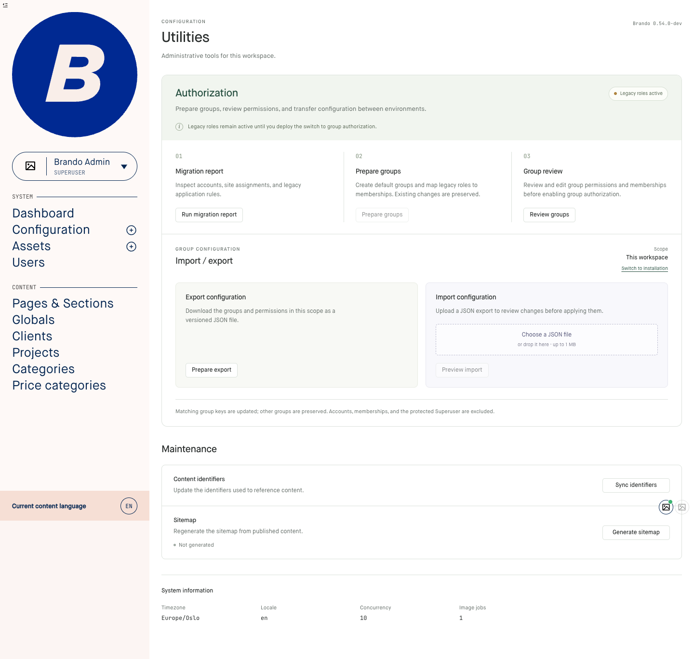
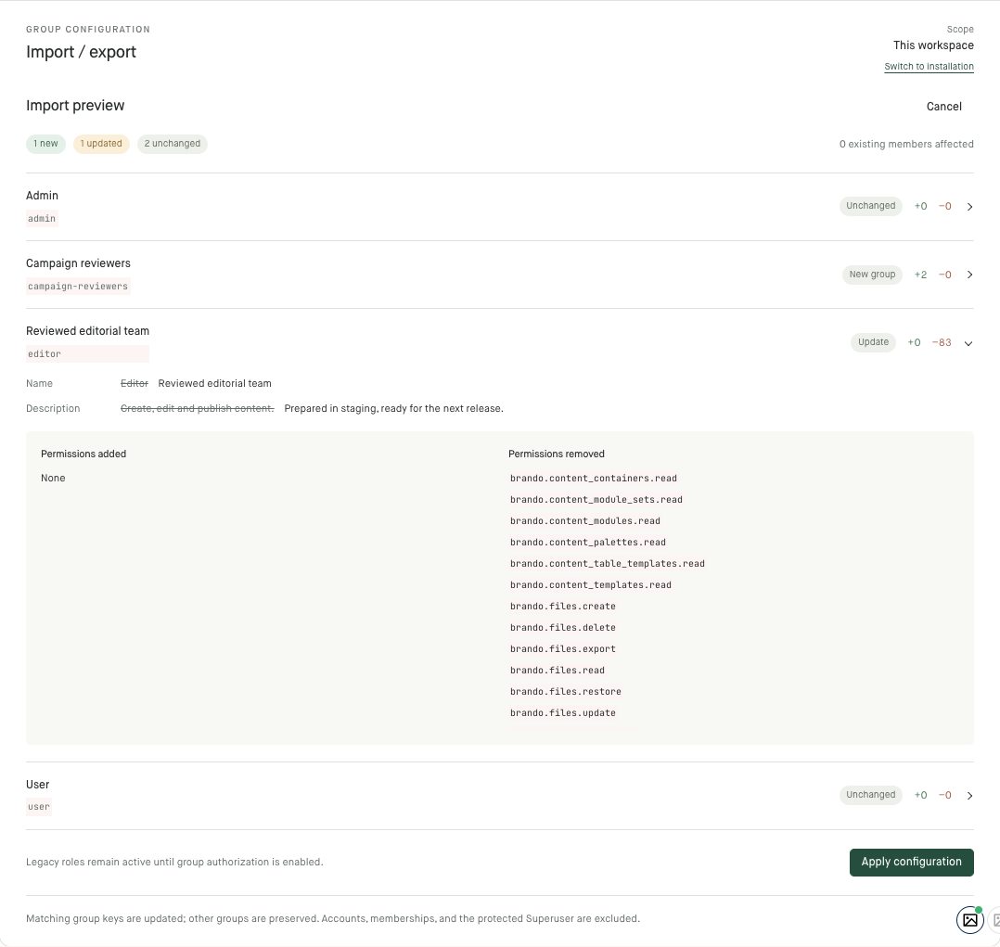

# Admin UI design guide

Use this guide when creating or refining Brando admin screens. It records the
design direction approved during issue #2788 on 7 September 2026: restrained
colors, clear grouping, compact controls, deliberate spacing, and factual copy.
Apply it alongside existing components and the screen's functional requirements.
The measurements below are starting points from Utilities, not a mandate to
restyle every existing screen.

## Reference

The Utilities page is a worked example. Its main content shows the approved
spacing, action placement, maintenance rows, and system-information grouping.
The surrounding sidebar and avatar images come from the E2E fixture application.



The import preview shows how the same hierarchy extends to expanded details,
permission changes, and the final apply action.



Implementation references:

- [Utilities styles](../assets/css/views/config/Utils.css)
- [Authorization tools component](../lib/brando_admin/components/authorization_tools.ex)
- [Utilities LiveView](../lib/brando_admin/live/config/utils_live.ex)

## Start with the task and hierarchy

Give each section a clear purpose and place its actions next to the relevant
content. Use one page title, section headings, and smaller item titles. Make
related items share alignment, spacing, and control treatment.

Choose a bounded width for settings and configuration. Utilities uses a 1120px
maximum; dense tables and editors may need more. A wide monitor should not pull
short descriptions, actions, and metadata to opposite edges of the screen.

Use numbered steps for an actual sequence. Use cards to group distinct workflows
such as import and export. Use a single bordered list with dividers for simple
maintenance actions: description on the left, action on the right. Let content
determine row height. Oversized cards with one short sentence create unnecessary
empty space.

## Make spacing a system

Start with a small spacing scale: 4, 8, 12, 16, 24, and 32px. Adjust deliberately
for the existing layout and actual text wrapping.

| Relationship | Starting point |
| --- | --- |
| Item title to description | 4–8px |
| Description to action below it | At least 16px |
| Related actions | 8–12px |
| Card or settings-row padding | 20–24px |
| Major sections | 24–32px |
| Metadata label to value | 4px |

Separate button padding from the space around the button. Increasing button
height does not solve a button touching the paragraph above it.

### Let the layout own the gap

Brando's [global stylesheet](../assets/css/app.css) includes:

```css
p:last-of-type {
  margin-bottom: 0 !important;
}
```

This cancelled the intended paragraph margins in the first Utilities design.
Several buttons had a measured gap of zero despite apparently correct local CSS.
Use parent `gap` or padding on an action wrapper so spacing survives the reset:

```css
.screen-actions {
  display: flex;
  flex-wrap: wrap;
  align-items: center;
  gap: 12px;
  padding-top: 16px;
}

/* Within a column of related steps, align actions while retaining the gap. */
.screen-step .screen-actions {
  margin-top: auto;
}
```

Inspect computed styles before adding specificity or another `!important`.
Keep fixes scoped to the screen; changing a global reset needs a separate review
of the screens it affects. Measure the rendered gap after the longest description
wraps, as well as with shorter text.

## Keep controls compact and predictable

Utilities uses 30px desktop buttons: 12px text, 18px line height, 5px vertical
padding, 12px horizontal padding, a 1px border, and a 5px radius. These proportions
are a useful starting point for secondary admin actions. Coarse-pointer controls
use a minimum height of 40px; check touch usability in context.

Align equivalent actions consistently. In a settings list, use a shared right
edge and consistent widths where the labels allow it. In parallel workflow
cards, align actions at the bottom while preserving a minimum gap from content.
On narrow screens, stack the action under its description with a 16px gap.

Give the main consequential action stronger emphasis. Keep navigation and
secondary actions quieter. Use verbs that describe the result: “Run migration
report”, “Sync identifiers”, “Preview import”, “Apply configuration”.

Use consistent icons from the existing icon system. A disclosure chevron should
have a consistent size, stroke, alignment, and open state. Omit decorative arrows
that add no information. Keep visible keyboard focus, accessible names for
icon-only controls, and understandable loading and disabled states.

## Use typography and color to establish hierarchy

Retain Brando's existing typefaces. The Utilities scale is approximately 30px for
the page title, 18–22px for section headings, 13–14px for item titles, and 12–13px
for descriptions. Small metadata is subordinate, but it still needs to be readable
at normal zoom. Do not shrink essential instructions to make a layout fit.

Use regular or medium weights, restrained borders, and minimal shadows. Sentence
case suits headings and actions. Reserve small uppercase labels for short context
labels, and use monospace for keys, configuration, and technical values.

The approved palette uses these roles:

| Role | Utilities reference |
| --- | --- |
| Main text | `#272b2a` |
| Secondary text | `#626b66` |
| Borders | `#dce2dc` |
| Main accent | `#254e3f` |
| Authorization header | `#f1f5ef` |
| Export surface | `#f8f9f5` |
| Import surface | `#f8f8fc` |

Prefer existing design tokens where they serve the same purpose. Keep tinted
surfaces subtle, and check text and control contrast in the rendered interface.
Status needs a textual label as well as color.

## Write factual, useful copy

Use the language of the task. Explain the action, relevant consequences, and the
next step when needed. Avoid cute catchphrases, promotional headings, and invented
personality. “Import / export” is a useful heading on an administrative screen.

Describe empty states naturally: “Not generated” for an absent sitemap, followed
by “Last generated: …” when a timestamp exists. Keep descriptions concise, but
preserve facts the user needs to act safely, such as whether an import affects
existing members.

## Present metadata as information

Use a semantic description list (`dl`, `dt`, `dd`) with labels above values and
consistent column spacing. Bound its width and reduce the column count on narrow
screens. Avoid distributing a handful of tiny label/value pairs across the full
viewport with `justify-content: space-between`.

Show effective configuration values. The initial Image jobs field was blank
because the setting was unset, although the application uses a default of 1.
Resolve the same default as the consuming code. If a value cannot be determined,
display a meaningful unknown state instead of inventing a value.

## Verify the rendered result

CSS that looks right in a diff is insufficient evidence of a finished layout.

Before editing, search the existing E2E tests for the page's route, labels, and
selectors. Include those tests in local validation alongside new tests. A new
workflow test does not replace existing coverage of the page's other actions.
Update assertions affected by an intentional redesign while preserving their
behavioral coverage. When fixing a failing test, rerun that specific test first.

1. Build changed JS/CSS through the E2E consumer, following [AGENTS.md](../AGENTS.md).
   Source `e2e/.envrc` first. Do not use a standalone root asset build as a gate.
2. Inspect the actual page with its real styles and fonts. Reload after rebuilding
   when hot reload is unavailable. Check computed styles when spacing disagrees
   with the source.
3. Check the normal desktop layout and narrow widths, including 390px. Look for
   overflow, awkward wrapping, missing values, crowded actions, and inconsistent
   alignment. Allow resize transitions to settle before taking screenshots.
4. Inspect relevant states: empty, loading, disabled, error, populated, and
   expanded details. Check keyboard focus and long labels or filenames where
   they occur. Run focused behavioral tests appropriate to the changes.
5. Take and inspect fresh screenshots. When presenting UI work, show the user a
   screenshot of the actual implementation. Keep saved reference images current
   when the approved design changes.

## External references

These sources informed the Utilities refinement. Use their underlying principles
while retaining Brando's visual identity:

- [Stripe: styling](https://docs.stripe.com/stripe-apps/style) — reusable spacing
  values and consistent component styling.
- [Stripe: action buttons](https://docs.stripe.com/stripe-apps/patterns/action-buttons)
  — predictable action placement.
- [Supabase: layout](https://supabase.com/design-system/docs/ui-patterns/layout)
  — content-appropriate widths, grouped settings, and actions placed with their
  relevant content.
