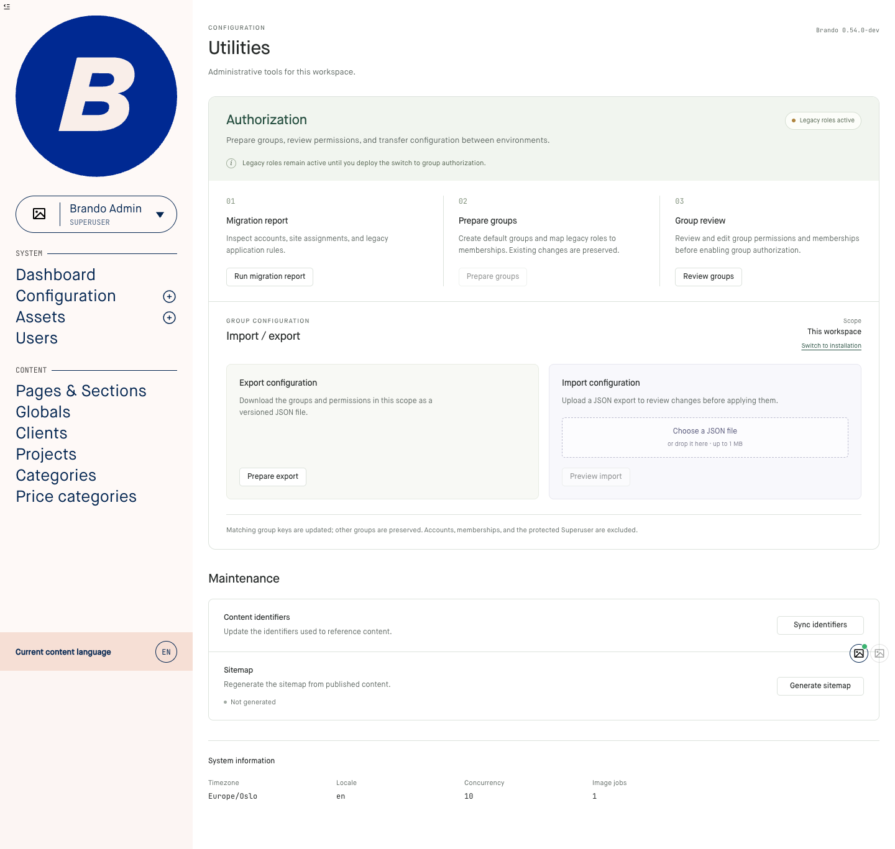
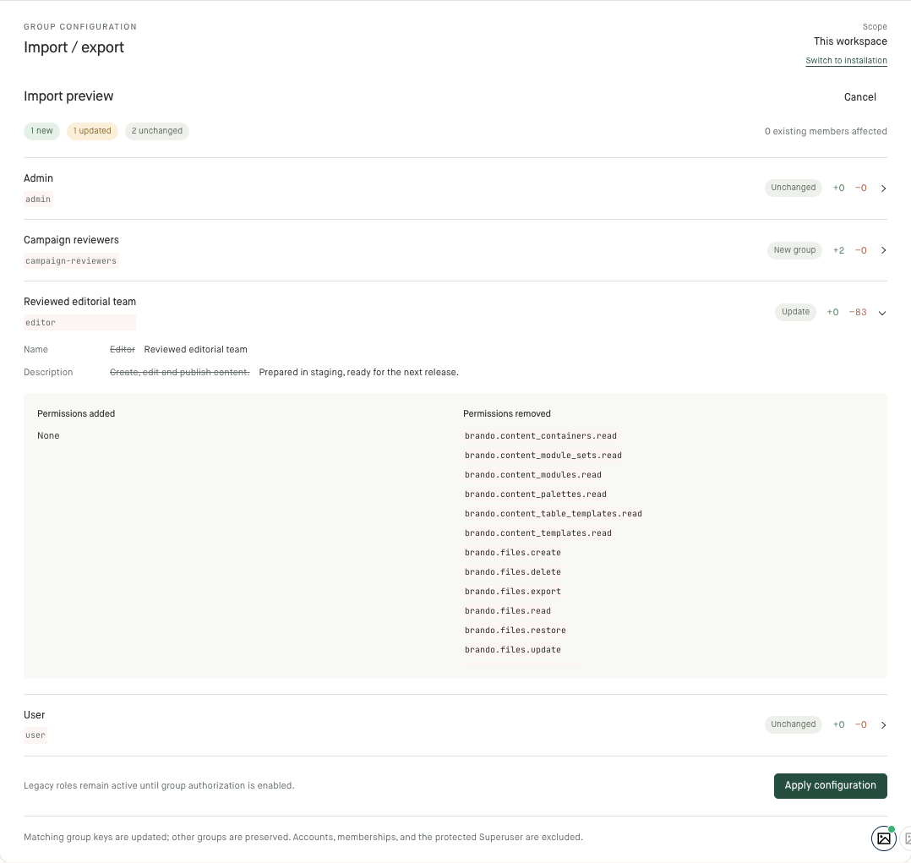
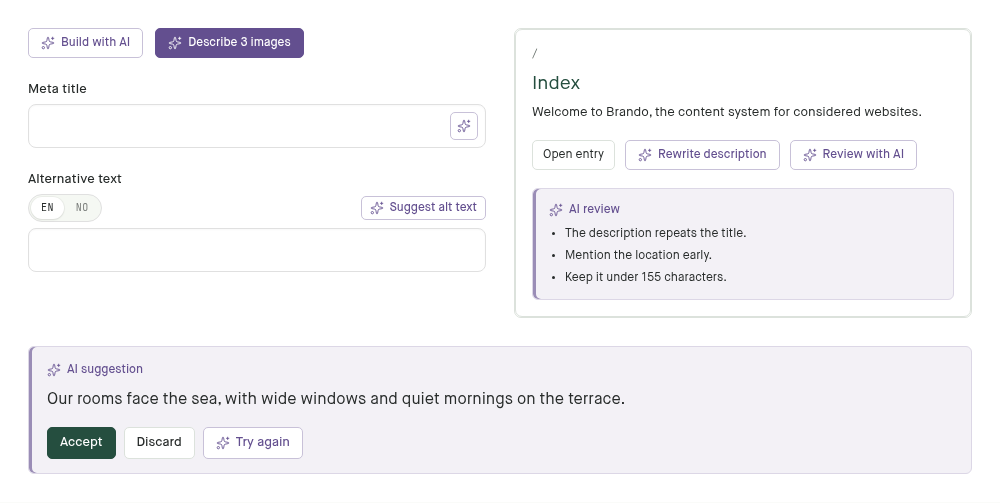

# Admin UI design guide

Use this guide when creating or refining Brando admin screens. It records the
design direction approved during issue #2788 on 7 September 2026: restrained
colors, clear grouping, compact controls, deliberate spacing, and factual copy.
Apply it alongside existing components and the screen's functional requirements.
The measurements below are starting points from Utilities, not a mandate to
restyle every existing screen.

## Reference

The Utilities page is a worked example. Its main content shows the approved
spacing, action placement, maintenance rows, and system-information grouping.
The surrounding sidebar and avatar images come from the E2E fixture application.



The import preview shows how the same hierarchy extends to expanded details,
permission changes, and the final apply action.



Implementation references:

- [Utilities styles](../assets/css/views/config/Utils.css)
- [Authorization tools component](../lib/brando_admin/components/authorization_tools.ex)
- [Utilities LiveView](../lib/brando_admin/live/sites/utils_live.ex)

## Start with the task and hierarchy

Give each section a clear purpose and place its actions next to the relevant
content. Use one page title, section headings, and smaller item titles. Make
related items share alignment, spacing, and control treatment.

Choose a bounded width for settings and configuration. Utilities uses a 1120px
maximum; dense tables and editors may need more. A wide monitor should not pull
short descriptions, actions, and metadata to opposite edges of the screen.

Use numbered steps for an actual sequence. Use cards to group distinct workflows
such as import and export. Use a single bordered list with dividers for simple
maintenance actions: description on the left, action on the right. Let content
determine row height. Oversized cards with one short sentence create unnecessary
empty space.

## Make spacing a system

Start with a small spacing scale: 4, 8, 12, 16, 24, and 32px. Adjust deliberately
for the existing layout and actual text wrapping.

| Relationship | Starting point |
| --- | --- |
| Item title to description | 4–8px |
| Description to action below it | At least 16px |
| Related actions | 8–12px |
| Card or settings-row padding | 20–24px |
| Major sections | 24–32px |
| Metadata label to value | 4px |

Separate button padding from the space around the button. Increasing button
height does not solve a button touching the paragraph above it.

### Let the layout own the gap

Brando's [global stylesheet](../assets/css/app.css) includes:

```css
p:last-of-type {
  margin-bottom: 0 !important;
}
```

This cancelled the intended paragraph margins in the first Utilities design.
Several buttons had a measured gap of zero despite apparently correct local CSS.
Use parent `gap` or padding on an action wrapper so spacing survives the reset:

```css
.screen-actions {
  display: flex;
  flex-wrap: wrap;
  align-items: center;
  gap: 12px;
  padding-top: 16px;
}

/* Within a column of related steps, align actions while retaining the gap. */
.screen-step .screen-actions {
  margin-top: auto;
}
```

Inspect computed styles before adding specificity or another `!important`.
Keep fixes scoped to the screen; changing a global reset needs a separate review
of the screens it affects. Measure the rendered gap after the longest description
wraps, as well as with shorter text.

## Keep controls compact and predictable

Utilities uses 30px desktop buttons: 12px text, 18px line height, 5px vertical
padding, 12px horizontal padding, a 1px border, and a 5px radius. These proportions
are a useful starting point for secondary admin actions. Coarse-pointer controls
use a minimum height of 40px; check touch usability in context.

Align equivalent actions consistently. In a settings list, use a shared right
edge and consistent widths where the labels allow it. In parallel workflow
cards, align actions at the bottom while preserving a minimum gap from content.
On narrow screens, stack the action under its description with a 16px gap.

Give the main consequential action stronger emphasis. Keep navigation and
secondary actions quieter. Use verbs that describe the result: “Run migration
report”, “Sync identifiers”, “Preview import”, “Apply configuration”.

Use consistent icons from the existing icon system. A disclosure chevron should
have a consistent size, stroke, alignment, and open state. Omit decorative arrows
that add no information. Keep visible keyboard focus, accessible names for
icon-only controls, and understandable loading and disabled states.

## Tab views

Approved on 5 October 2026: every tab view in the admin is **pill tabs**, from
the module editor's "In the block / Configure modal" switch, shared as
`.pill-tabs` in `TabSwitch.css`. The track is `#f7f8f6` with a 1px `#eceeea`
border, a 22px radius and 3px of padding. Tabs are 13px/18px with 6px 14px of
padding, muted by opacity. The selected tab is a raised white pill
(`0 1px 2px` shadow, weight 500). Do not use underlined tabs, tinted tabs or
button groups.

```heex
<nav class="pill-tabs" aria-label={gettext("Sections")}>
  <button type="button" aria-current={@tab == "export" && "page"}>
    <.icon name="upload" />{gettext("Export")}
  </button>
  <button type="button" aria-current={@tab == "history" && "page"}>
    {gettext("Recent imports")} <span class="pill-tabs-count">{@count}</span>
  </button>
</nav>
```

- Mark the selected tab with `.active`, `aria-current="page"`,
  `aria-selected="true"` or `aria-pressed="true"` (pass a string:
  `to_string(@tab == key)`; a bare boolean renders no value).
- An icon goes before the label; a number goes after it in
  `.pill-tabs-count`. A badge with its own meaning, like the SEO score, keeps
  its own class.
- `.pill-tabs--small` is the compact size for toolbars inside a panel (the
  history drawer, the assistant's preview controls).
- A track with one tab shows it as a plain caption.
- The link pickers' `Input.radios` take the same look through
  `.link-picker-modes .radios-wrapper`.
- A sticky bar that holds tabs and actions (the module editor) is a white bar
  around the track. The entry form's toolbar is split instead: see
  [Entry editor heading and settings screens](#entry-editor-heading-and-settings-screens).
  A tab bar's old class (`.transfer-tabs`, `.activity-tabs`…) stays on it for
  layout and tests only.

Two things are not tab views and keep their own look: the small mono language
pills on translatable fields (`.i18n-tabs`), and toggles and filters (Grid /
List switches, status filters, filter chips). Section rails in modals
(`Content.modal_sections`) are vertical navigation, not a tab bar.

## Use typography and color to establish hierarchy

Retain Brando's existing typefaces. The Utilities scale is approximately 30px for
the page title, 18–22px for section headings, 13–14px for item titles, and 12–13px
for descriptions. Small metadata is subordinate, but it still needs to be readable
at normal zoom. Do not shrink essential instructions to make a layout fit.

Use regular or medium weights, restrained borders, and minimal shadows. Sentence
case suits headings and actions. Reserve small uppercase labels for short context
labels, and use monospace for keys, configuration, and technical values.

The approved palette is defined once, as custom properties in
[`assets/css/tokens.css`](../assets/css/tokens.css). Use the token, not its
value:

| Role | Token | Value |
| --- | --- | --- |
| Main text | `--brando-ink` | `#272b2a` |
| Secondary text | `--brando-muted` | `#626b66` |
| Text and icons on a dark fill (accent buttons, checks, photos) | `--brando-ink-inverse` | `#ffffff` |
| Placeholders, disabled text, counters | `--brando-faint` | `#9aa39c` |
| Borders and dividers | `--brando-line` | `#dce2dc` |
| Border on hover or focus, drop target outline | `--brando-line-strong` | `#bacabd` |
| Dividers between rows inside a framed list or table | `--brando-line-soft` | `#ecf0ea` |
| Main accent (actions, links, focus, progress) | `--brando-accent` | `#254e3f` |
| Primary button on hover | `--brando-accent-hover` | `#1a3d30` |
| Page ground | `--brando-surface-page` | `#fafbf9` |
| Content, cards, inputs | `--brando-surface` | `#ffffff` |
| Subform surface | `--brando-surface-subform` | `#f8fbf6` |
| Subform border | `--brando-line-subform` | `#e2e9df` |
| Table header and footer rows, shaded fieldsets | `--brando-surface-shaded` | `#fbfcfa` |
| Row hover | `--brando-surface-hover` | `#f5f8f3` |
| Selected item, drop target | `--brando-surface-selected` | `#eef3ea` |
| Neutral notice, section header, icon tile, hovered secondary button | `--brando-surface-tint` | `#f1f5ef` |
| Modal and loader backdrop | `--brando-overlay` | `rgb(30 43 37 / 30%)` |
| Badge fill / ink | `--brando-badge-bg` / `--brando-badge-ink` | `#eef0eb` / `#566153` |
| Needs attention (missing alt text, unsaved, warning badges): tint / rule / ink | `--brando-attention` / `--brando-attention-line` / `--brando-attention-ink` | `#fbefda` / `#e4b866` / `#87662d` |
| Done or fine (passed check, added line, active or connected, finished import): tint / border / ink | `--brando-success` / `--brando-success-line` / `--brando-success-ink` | `#e8f2e9` / `#d0e3d2` / `#2f6343` |
| Errors (failed save or upload, invalid field, destructive action): tint / border / ink | `--brando-error` / `--brando-error-line` / `--brando-error-ink` | `#fff1ed` / `#e8ccc4` / `#8c4232` |
| Switch on / off | `--brando-switch-on` / `--brando-switch-off` | `#9cc79f` / `#c0c0c0` |
| Status: published | `--brando-status-published` | `#3cb371` |
| Status: pending | `--brando-status-pending` | `#f1ac00` |
| Status: draft | `--brando-status-draft` | `#636363` |
| Status: deactivated | `--brando-status-disabled` | `#cd5c5c` |
| Status: deleted | `--brando-status-deleted` | `#171a18` |

Modules can be given a colour. Blue, the default, draws a block's chrome with
the neutral roles above; pink, emerald and peach use
`--brando-module-<colour>-line`, `-tint`, `-ink` and `-dot` (the outline's
dot), which keep those categories apart in the block editor.

Utilities' authorization header uses `--brando-surface-tint`; its import and
export cards share `--brando-surface-shaded`. Screens don't keep tints of
their own: a blue or lavender panel becomes a neutral surface, and an "OK",
"added" or "active" state uses the success tokens.

The legacy Europa colours in `assets/europa.config.js` are deprecated, and
Brando's stylesheets no longer use them. They point at these roles, so
`theme(colors.dark)` is `--brando-ink`, `blue` is `--brando-accent`, `peach` is
`--brando-surface-subform`, `peachDarker` is `--brando-surface-selected` and
`colors.status.*` are the status tokens. The old custom properties are aliases:
`--brando-color-dark` → `--brando-ink`, `--brando-color-blue` →
`--brando-accent`, `--brando-color-peach` → `--brando-surface-subform`. They
are kept, marked deprecated in `tokens.css`, only for applications whose own
admin CSS still uses them. Use the role names.

Do not add hex colours to admin stylesheets. CI runs
`.github/scripts/check_css_colors.sh`, which fails when a file outside
`tokens.css` gains a hex literal. Files not yet converted are listed with their
current count in `.github/css-color-allowlist.txt`; when you convert colours,
lower the count (or remove the entry), which `--update` rewrites for you. A
colour that has no role yet belongs in `tokens.css` under a role name. For a
translucent version of a role, mix it with transparent:
`color-mix(in srgb, var(--brando-ink) 8%, transparent)`.

Native checkboxes, radios, range sliders and progress bars take the accent from
one `accent-color` on `:root` in `assets/css/base.css`; don't set it per
component. Picker and listing status dots use the status tokens.

Keep tinted surfaces subtle, and check text and control contrast in the
rendered interface. Status needs a textual label as well as color.

## Write factual, useful copy

Use the language of the task. Explain the action, relevant consequences, and the
next step when needed. Avoid cute catchphrases, promotional headings, and invented
personality. “Import / export” is a useful heading on an administrative screen.

Describe empty states naturally: “Not generated” for an absent sitemap, followed
by “Last generated: …” when a timestamp exists. Keep descriptions concise, but
preserve facts the user needs to act safely, such as whether an import affects
existing members.

## Present metadata as information

Use a semantic description list (`dl`, `dt`, `dd`) with labels above values and
consistent column spacing. Bound its width and reduce the column count on narrow
screens. Avoid distributing a handful of tiny label/value pairs across the full
viewport with `justify-content: space-between`.

Show effective configuration values. The initial Image jobs field was blank
because the setting was unset, although the application uses a default of 1.
Resolve the same default as the consuming code. If a value cannot be determined,
display a meaningful unknown state instead of inventing a value.

## Verify the rendered result

CSS that looks right in a diff is insufficient evidence of a finished layout.

Before editing, search the existing E2E tests for the page's route, labels, and
selectors. Include those tests in local validation alongside new tests. A new
workflow test does not replace existing coverage of the page's other actions.
Update assertions affected by an intentional redesign while preserving their
behavioral coverage. When fixing a failing test, rerun that specific test first.

1. Build changed JS/CSS through the E2E consumer, following [AGENTS.md](../AGENTS.md).
   Source `e2e/.envrc` first. Do not use a standalone root asset build as a gate.
2. Inspect the actual page with its real styles and fonts. Reload after rebuilding
   when hot reload is unavailable. Check computed styles when spacing disagrees
   with the source.
3. Check the normal desktop layout and narrow widths, including 390px. Look for
   overflow, awkward wrapping, missing values, crowded actions, and inconsistent
   alignment. Allow resize transitions to settle before taking screenshots.
4. Inspect relevant states: empty, loading, disabled, error, populated, and
   expanded details. Check keyboard focus and long labels or filenames where
   they occur. Run focused behavioral tests appropriate to the changes.
5. Take and inspect fresh screenshots. When presenting UI work, show the user a
   screenshot of the actual implementation. Keep saved reference images current
   when the approved design changes.

`e2e/playwright/scripts/admin-ui-references.mjs` retakes the reference images
linked from these docs. Start the E2E server (`cd e2e && source .envrc &&
MIX_ENV=e2e mix phx.server`), then in a second terminal run `cd e2e && source
.envrc && node playwright/scripts/admin-ui-references.mjs`; `--list` prints the
catalogue and `--only <name>` retakes one image. Take the committed references
on a Mac: Linux renders the admin's text differently.

## AI actions and suggestions

Approved with issue #2983. Everything AI in the admin uses two looks, so an
editor recognises AI the same way everywhere and it belongs to the admin's
palette. Both live in `assets/css/components/AI.css`.



**The AI action** is any control that asks AI for something: Build with AI,
Suggest alt text, the generate button in a meta field, Write or Review with AI
in Content SEO, Draw a sketch with AI. It is a small secondary button: the
Lucide `sparkles` icon, `--brando-accent` text, a solid sage hairline (the
accent mixed into `--brando-line`), white, 30px high with a 5px radius, like
the other small admin buttons. Render it with `AIAction.button/1`:

```heex
<AIAction.button phx-click="suggest_alt_text" phx-target={@myself} size={:compact}>
  {gettext("Suggest alt text")}
</AIAction.button>
```

- `href` makes it a link (Build with AI opens the assistant in a new tab).
- `size={:compact}` (24px) beside a field's label; `size={:icon}` (28px
  square, with an `aria-label`) inside a text field.
- `busy` while the request runs: the sparkles pulse and the button stays
  fully visible; `disabled` fades it. Focus is the admin's 2px accent outline.
- In a toolbar or a menu, an AI item keeps the host's shape and only takes
  the accent and the sparkles: the rich-text toolbar's sparkles button, the
  listing's "Translate to" menu item (icon after the label, so the labels stay
  aligned).
- A costed batch's confirm step ("Write 3 descriptions", "Describe 3 images",
  after the estimate) stays the panel's primary button, with the sparkles.
- Sidebar rows are navigation, not actions: the Assistant row keeps the
  sidebar's look with the `sparkles` icon.

**The suggestion** is what AI hands back for review before it is content: a
rich-text rewrite, a Content SEO review, suggested meta descriptions or alt
text, what an assistant proposal adds. It sits on the suggestion tint
(`--brando-suggestion`, mixed lighter for a panel) with a 3px
`--brando-suggestion-line` rule down its left edge, and is labelled with the
sparkles in `--brando-suggestion-ink` ("AI suggestion", "AI review"). Accept is
the primary button beside it; Discard and Try again are secondary.

- A panel: `.ai-proposal`, its label `.ai-proposal-label`, its buttons in
  `.ai-proposal-actions`.
- Suggested text the editor can still change before accepting
  (`SuggestionReview`): the textarea takes `.ai-proposal-field`.
- The assistant's proposals use the same tokens for new and changed blocks.

Do not:

- use purple, or any colour outside the tokens, for AI;
- draw an AI action or a suggestion with a dashed border — dashed means
  "drop here" in the block editor;
- fill a field with an AI result and style it as a suggestion: text written
  straight into a field (Generate with AI, Suggest alt text) is ordinary unsaved
  input, kept or discarded with the form;
- add a second AI button style for a new screen; add a size to `AIAction`
  instead.

## Confirmations, alerts and toasts

Confirmations and alerts use the native `<dialog>` (`assets/src/alerts.js`):
left-aligned, a question as the title, the explanation under it, and compact
buttons on a shared right edge. Write the title as the question and name the
confirm button after its result rather than “OK”:

```heex
<button
  type="button"
  phx-click="recreate_image_sizes"
  data-confirm-title={gettext("Recreate image sizes?")}
  data-confirm={gettext("Every image’s sizes are made again from its original.")}
  data-confirm-ok={gettext("Recreate sizes")}
>
```

Without `data-confirm-title`, the `data-confirm` text becomes the title. Add
`data-confirm-destructive` for actions that delete or discard: the confirm
button turns red and Cancel takes the initial focus. `phx-confirm-click` (the
`ConfirmClick` hook) takes the same title, message and labels.

Toasts share one stack in the bottom right (`assets/src/Toast`). Results of the
user's own actions show a status dot — success fades, errors stay until closed.
Other editors' changes appear quieter, with their initials, and fade sooner.
Messages are plain text.

## Shared text diffs

Use `BrandoAdmin.Components.TextDiff.diff/1` for line-by-line text comparisons.
Content transfer, module-file import review and recovery-copy previews use this component. Its shared
styles live in `assets/css/components/TextDiff.css`, and its English/Norwegian
labels use the `admin_diff` Gettext domain.

```heex
<TextDiff.diff
  id={"template-diff-#{@module.uid}"}
  label={gettext("Template")}
  before={@saved_template || ""}
  after={@incoming_template || ""}
  description={gettext("Current → imported")}
  monospace
/>
```

Supply a stable ID and plain strings, or a list of `%{text: text, key: identity}` lines.
Optional `type: :heading | :media | :detail` provides restrained hierarchy.
Keys distinguish different assets with the same filename and different placements;
they are never rendered. Keep keys stable across the two sides, including any
source-to-destination asset mappings. Serialize structured values at the caller;
use an empty string for an absent side so it does not appear as removed text.
The panel escapes content, marks additions/removals, retains unchanged context,
and includes line numbers, translated counts and a keyboard-scrollable viewport.
`description`, `empty_text` and `note` provide context-specific copy; `monospace`
is useful for code and JSON. The parent layout owns the surrounding spacing.

Previews are bounded to 12,000 characters and 400 lines per side and explicitly
label truncation. For block comparisons, `BrandoAdmin.ContentPreview.lines/2`
projects loaded blocks
or portable blocks with an asset index into readable text and media references.
It includes image/file/video filenames, gallery order and selected authored metadata.
It preserves placement context, so moved media appears as removal and addition.
Explain that rendered layout and other settings still need their own review.
Recovery previews compare readable payload sections against a freshly loaded
saved entry, retaining field identities and omitting editor capability settings.
Show only changed sections and lines by default, retaining their field labels.
The “Show unchanged content” checkbox reveals the full preview and persists
through LiveView patches. Keep truncation notices visible in both modes.
Copy text includes the recovery side; JSON export keeps the original payload.
Keep one recovery comparison, without a duplicate scalar summary. Resolve media
and related-entry references in batches for both sides; keep their identity in
line keys and show thumbnails, filenames and entry titles. Optional line
`preview` metadata supplies the kind, thumbnail and details to the shared viewer.
Image thumbnails use fixed width and automatic height. Missing records remain
visible as unavailable references. Recovery capture timestamps must not advance
when a copy is dismissed, reviewed or renewed without content changes.
Match recovery blocks (including children) by UID and gallery placements by
identity before comparing their content. Show reordering in a separate compact
movement list with names/thumbnails and old → new positions; keep edits to those
same items in the text diff. Inserting or deleting an item must not turn every
shifted neighbour into a move. Gallery objects and their overrides should produce
one movement summary. The expanded recovery diff uses page scrolling: reset both
internal overflow and scroll containment so mouse-wheel input reaches the page.
Shared-library template overrides are another suitable use; permission sets and
record relationships need their structured comparisons.

## External references

These sources informed the Utilities refinement. Use their underlying principles
while retaining Brando's visual identity:

- [Stripe: styling](https://docs.stripe.com/stripe-apps/style) — reusable spacing
  values and consistent component styling.
- [Stripe: action buttons](https://docs.stripe.com/stripe-apps/patterns/action-buttons)
  — predictable action placement.
- [Supabase: layout](https://supabase.com/design-system/docs/ui-patterns/layout)
  — content-appropriate widths, grouped settings, and actions placed with their
  relevant content.

## Shared workspaces and form sections

Use `Workspace.header` and the opt-in `admin-workspace` styles for list and
settings screens. Existing generated listing LiveViews also inherit these styles
when `Content.List` is rendered directly inside the main content article. This
compatibility scope includes `Content.header` and its actions, so applications
do not need to regenerate their listings. Explicit workspace wrappers retain
their own layout without a second surrounding workspace. Keep regression
coverage for the old generated markup alongside Pages and the new generator.

Custom listing rows using `update_link` get the title treatment automatically;
they do not require the Pages-specific `listing-title` class. Preserve custom
cells, cover images, checklists, and creator metadata at desktop and mobile sizes.
Keep the original vertical checklist pills and application-defined category
typography. Give metadata columns consistent widths so shorter category lists
share the same left edge as longer ones.
Keep media folder navigation shared between images, files,
and videos. Show the current folder's count using the same scope as the list.
Keep item titles primary; formats, dimensions, file sizes, authors, and timestamps
are secondary information. Avoid exposing URL query strings as video metadata.

Blueprint fieldsets accept `label t("Section name")` for a translated legend.
A read-only `component &Module.preview/1` can render from the current `form`
assigns without maintaining a separate copy of pending values. Keep form IDs,
input names, component IDs, upload targets, and save ownership stable.

Constrain avatar photos and their image wrappers to their container. Source
`width`/`height` attributes and a non-shrinking image wrapper can otherwise expand
a small presence avatar over the page. Clip the photo wrapper, leaving status
dots and focus rings outside it visible. Verify presence after a LiveView patch,
not just on the initial render.


## Listing and editor refinement checks

Work at **1440px first**, then check 390px and expanded content. Review screenshots
at their actual scale; a reduced full-page image can disguise small typography
and misalignment. Use populated rows, long namespaces, photos and initials,
child entries, open menus, and real form values.

- Use 32px workspace headings, 17–18px section headings, and 15px listing titles.
  Keep secondary metadata smaller without making it pale or difficult to read.
- A listing toolbar should share one surface and baseline. Filters and sort
  controls use a 38px box with symmetric padding. Status dots are at least 1em,
  optically centered with their labels. Remove inherited margins before adjusting
  position. The font stored as Main can differ between consumer applications.
  Status labels use `text-box: trim-both cap alphabetic` so alignment follows the
  font's capital height; descenders extend naturally below it. Older browsers use
  the configurable `--status-label-offset` fallback (2px by default). Untrimmed DOM
  bounding-box centers do not prove optical alignment: inspect close-ups with the
  actual consumer font as well as the E2E font. See [Chrome's text-box guide](https://developer.chrome.com/blog/css-text-box-trim)
  for the font-metric behavior.
- Show creator photos when available and centered initials otherwise. Keep creator
  information visible on mobile by giving it a deliberate place in the row.
  Clip image wrappers as well as images to the avatar's dimensions.
- Keep child disclosures rectangular and compact, with an aligned count and one
  chevron. Reserve enough room for the full namespace rather than forcing it into
  a narrow badge. Verify opening the children, including records with no status.
- Text inputs and custom selects in a form must share height, type size, and
  baseline: 44px in content editors, 40px in settings, with 14px text. Keep labels
  on one line where appropriate; inline presence elements can otherwise create an
  extra label line even when the visible text fits.
- Use one spacing owner for settings: 24px between fieldsets, 16px between related
  fields, 8px from label to control, and 24px from the final group to Save. Do not
  stack fieldset, nested fieldset, and input margins for the same relationship.
- Give repeated editor rows a quiet tinted parent surface and white fields/rows.
  On mobile, arrange the status and row actions together, followed by labelled
  fields. Keep editing and deletion controls distinguishable.
- A settings toolbar is a white bar with one sage action accent. Its sections
  are pill tabs (see [Tab views](#tab-views)); a single section is a plain label.
- Use the same chevron asset and rendered dimensions across neighboring dropdowns.
  Preserve visible keyboard focus. Test Enter, Space and Escape against real
  controls; closing an already closed dialog must not toggle it open internally.

A passing overflow check is only the first audit. Follow it with screenshot
inspection, measured alignment checks, and the existing local workflow tests.
Capture fresh screenshots after the last change. Record limitations honestly;
visual approval belongs to the person using the interface.


## Entry editor heading and settings screens

Approved in #2982 (October 2026). An entry editor heads itself with the entry:
a 12px muted breadcrumb (the content type's icon, its listing name linked to
the listing, the blueprint's own name for its entries where it has one, and
the language: `Projects · Case · EN`), then the entry's title as a 32px ink
heading at weight 500, or "New case" before the first save. The status is one
pill beside the title (dot, label, chevron) opening the choices as radios of
the entry form; choices the user may not save are disabled, following
`Engine.publication_allowed?/2`. `Form.EntryHeader` renders both, and
`EntryHeader.css` styles them. The heading follows the saved entry, so typing
in the title costs no server work.

The toolbar under it is split (approved October 2026) and keeps to one row.
On the left, straight on the page, the sections and drawers (Content, Meta,
History, Scheduled publishing) as `.pill-tabs--small`. On the right, in their
own white group with the bar's border, radius and surface: the editors
present as compact overlapping avatars (the count of editors is in their
tooltip), the save state ("Saved 23:20", "Unsaved changes", with the recovery
status as its title), Notes as an icon with a badge counting open notes,
Preview with its label and menu, a "⋯" More menu (Languages, Share preview;
an item that doesn't apply is left out, and an empty menu isn't drawn) and
Save and close with its options. Under 1366px Preview and Save drop their
icons to keep the row; when the tabs and tools still don't fit, the tabs
scroll in their track, then the tools take a row of their own. On a phone the
tabs take a row of their own and scroll inside their track.

When the bar sticks, content scrolling under it would show between the two
groups, so the stuck bar sits on a band of the page colour, faded at its
foot. The Form hook watches a sentinel above the bar with an
IntersectionObserver and sets `is-stuck` through sticky JS; no `:has()`.

Following another editor (click their avatar) draws a 2px frame in their
presence colour round the editing area, fixed to its edges on screen, and a
chip under the toolbar, "Following Ingrid ×". The frame takes no clicks;
the chip's ×, Escape, the avatar again, or your own scroll or click stop
following. The followed avatar has a double ring. Nothing about following
sits in the toolbar.

A singleton settings screen (Identity, SEO) passes `layout={:settings}` to
the form and puts `Workspace.header` above it: the eyebrow "Configuration",
the screen's name and one plain line on what it holds. Its tabs are pill tabs
under the heading, and its one Save sits in a sticky bar at the bottom with
the save state, leading on the left, clear of the editors' avatars. A
configuration entry with a listing (a menu, a global set) keeps the entry
heading and Save and close.

## Dashboard

Approved on 5 October 2026 (option E of the card studies). Recently updated
entries are cards in an auto-fill grid: the identifier's cover (or the content
type's icon on a grey field) at 16:10, the title, the content type with its
icon and language, then the status, when it changed and the last editor's
avatar. The title's link is stretched over the card, so the whole card opens
the entry. Drafts and scheduled publishing sit in a 300px side column of white
panels with a count; a scheduled entry shows a small date tile. Under 1240px
the side column moves below the cards; on phones a card becomes a row with a
square cover. No content-type shortcuts: the sidebar already lists them.

The cover is the entry's actual image with a `srcset` of every size it has
(blur placeholders left out, each width as actually saved), so it is sharp on
retina screens; the identifier's stored thumbnail is too small for a card and
only stands in until an image has its sizes. The status dot follows
`.modal-status`: `1cap` square, the label and time trimmed to cap height.

`BrandoAdmin.Dashboard` loads the data (the editors in one query);
`components/dashboard.ex` renders it, styled in `SettingsWorkspace.css`.

## Pending subform sweep

Requested on 8 September 2026; recorded for a later implementation pass. Use
Navigation → Edit menu → Menu items as the starting reference, then review the
shared subform components and other nested/repeated editors.

- Increase the status dot **inside the link preview field** to `1em` in both
  dimensions, relative to its accompanying text. This is separate from the row's
  status selector. Align the dot with the visible text and prevent flex shrinking.
- Subform surfaces on settings screens are one very light green,
  `--brando-surface-subform` with a `--brando-line-subform` border (approved 5 October 2026, replacing the earlier blue
  and olive tints). Retain white rows and input surfaces, readable
  labels/icons, and clear hover/focus states.
- Audit nested levels, row rhythm, label/control alignment, and action placement
  across subform usages. Inline subforms, menu items among them, are now tables
  (see [Inline subform tables](#inline-subform-tables)); re-check the items above
  against them. Check 1440px first, then 390px, including long link titles
  and URLs. Capture fresh screenshots and run the relevant local E2E workflows.

## Inline subform tables

Approved on 4 October 2026 (`design/drafts/redirects-subform.html`). An inline
subform (`inputs_for … style :inline, cardinality :many`) and a table block's
rows are both a table, built like `.identifier-list`: one `--brando-line` border with a
6px radius around the whole, hairlines between rows, white rows tinted
`--brando-surface-hover` on hover.

- Column headings appear once, in a `--brando-surface-shaded` header row, from each input's own
  label. A cell's label is visually hidden; its error shows under the control.
- Every row is one line. Controls take the block variables' compact look: 32px,
  13px, borderless until the row is hovered or the control focused. Media fields
  use `MediaField`'s `:line` presentation. A row wider than the form scrolls
  sideways inside the table rather than wrapping.
- Small controls (status, toggle, checkbox, radios, number, dates, colour)
  shrink their column to fit; text columns share the rest.
- The grip sits at the left and a ghost × at the right, shown on row hover. An
  insert button sits on the line above each row; "Add entry" and the count sit
  in a `--brando-surface-shaded` footer. A row added either way fades in, tinted for a moment.
- A field hidden by `show_if` leaves an empty cell, so later columns stay under
  their headings.

Two other lists share the frame. A `:string_list` input (`Input.input/1`) is
a framed list with the row number in a gutter, the same insert and remove
buttons, and its empty "Add another…" line last; the `Brando.StringList` hook
inserts and removes rows (`StringList.css`). A variable list (`Input.Vars`:
global sets, page variables, table templates) has a line per variable with
the grip and insert at the left, × at the right, and opens a variable in
place (`VarsList.css`).

`subform.ex` renders the subform's table; `block/render.ex` `table/1` renders a
table block's. `SubformTable.css` styles both, `TableBlock.css` adapts block
variables to it, and the `Brando.TableRows` hook animates added rows. The E2E
client form's "Inline fields" tab holds one of every input that fits on a line
(`E2eProject.Projects.InlineRow`); check changes there and in
`tests/projects/inline-subform.spec.js`.

## Icons

The admin uses [Lucide](https://lucide.dev/icons) at stroke width 1.5,
rendered with `<.icon name="…" />` (`Brando.HTML.Icon`) or `Icon.svelte` as
`<span data-icon class="lucide-name">`, masked by one cached stylesheet that
`Brando.Icons` generates. Use current Lucide names only;
`test/brando/icons_test.exs` fails on a literal name Lucide doesn't have. Size
icons with `width`/`height` and colour them with `color`. Target one icon with
`.lucide-name`. To change the vendored set, run
`mix brando.lucide.update VERSION`.

Keep icons as masked spans. An SVG sprite (`<svg><use href>`) was measured on
the 115-block e2e entry: one extra node and four dynamics per icon cost 13% on
mount and broke the bench's payload budget. The span adds nothing over the
Heroicons it replaced.

### Blueprint content-type icons

A blueprint declares its icon in its body:

```elixir
content_icon "folder-kanban"
```

`Brando.Blueprint.get_icon/1` resolves it, falling back to `file`. The sidebar,
the link picker's “Content types”, entry identifiers and
listing headers all use it, so a content type looks the same everywhere.

### Sidebar rows

Every sidebar row has an icon; items without one show `dot`, so the column
stays aligned. Top-level and sub-item icons share one 20px column (sub-item
glyphs are 16px, centred in it), so every label starts on the same line.
Labels are trimmed with `text-box: trim-both cap alphabetic`, so the text
centres on the icon's centre line: aim for under 0.5px between icon centre and
cap centre. Rows are 32px (top level) and 30px (sub-items) with no block
padding. Browsers without `text-box` sit the label a pixel or two high, which
is acceptable.

Search is a row too, built in by `BrandoAdmin.Nav` rather than configured: a
button after Dashboard (or at the top of the first section) that opens the
command palette, with the shortcut faint at its end (mono 11px, the muted nav
colour at 60%). It is never the current row. On phones, where the sidebar is
hidden, the round `.mobile-search` button opens the palette instead.

## Approved modal direction

The modal study approved on 8 September 2026 uses **B (Section rail)** as the
shared direction for the variable editor, block configuration, and transfer &
delete user. Show section navigation when the task has distinct sections; simple
confirmations and transfer dialogs do not need a rail merely for consistency.
Use **C (Split workspace)** for link picking: content types and search on the
left, results in the center, selected destination and link behavior on the right.
The shared shell is implemented in `Content.modal`; `Content.modal_sections`
provides the section rail and `SelectIdentifier` provides the link workspace.
Their styling lives in `assets/css/components/ModalWorkspace.css`.

Keep the title and context line in one compact stack centered beside the heading
icon. Treat creator name and role the same way beside an avatar. Trim the text
boxes to the font's capital height before setting the gap; centering oversized
line boxes leaves the visible text looking displaced. Modal titles use 22px text.
Heading and person text stacks both use an 8px gap, including equivalent creator
and recipient details. Keep these proportions on mobile and check wrapped titles.

Adjacent metadata values must share their type size and alignment row, including
values containing badges or status dots. The link sidebar uses 13px values inside
24px rows with centered contents. Keep status dots at least 1em. Verify the visible
text positions with the actual consumer font, not only the surrounding boxes.

Use subtle surface colors to distinguish context from editable content. The
approved transfer summary has a near-white sage surface (`#fbfff7`). Keep
headers and action rows outside the scrolling body, preserve input through nested
selection, and return to the original editor and section after choosing a link.
Block and variable settings currently update the parent form, so their completion
action remains Done. Apply/Cancel requires an actual isolated draft; do not imply
cancellation semantics with styling alone.

Section changes keep inputs mounted so LiveView validation retains edits. Escape
closes only the active dialog and returns focus to its opener; link openers must
be real buttons. Show and hide commands target direct dialog children to avoid
revealing nested dialogs. Cover these interactions with
`e2e/playwright/tests/modal-design.spec.js`, alongside the existing form,
block persistence, upload and accessibility tests.

### Compare implementation against the approved sketch

Use the actual approved render and its measurements as the reference; matching
only the broad layout is insufficient. Compare at 1440px with the consumer's
real font files. Review each context separately: a link variable inside a menu,
a nested variable dialog, and the rich-text dialog have different ancestors.

For the C sidebar, use a 21px/28px destination title, a 4px title-to-URL gap,
16px before metadata, 20px from creator to link fields, and 14px between the
link field and toggle. Keep field labels at 13px, the sidebar at 306px, and
its background at `#f4f7f9`. Heading/person stacks retain the approved 8px gap.

Align the C header icon, mode switch, and content-type heading text to the same
20px desktop inset. Use a shared 18px inset for the header and switch on mobile.
The selected entry's update timestamp includes the time in the configured site
timezone, alongside its localized date.

Form rules can override more than paragraph margins: definition-list margins,
subform label spacing, old dialog-specific tab margins, and uppercase toggle
styles also cross into nested dialogs. Inspect the winning rule and use a
scoped layout owner for gaps. Check visible alignment after scrolling, too:
a sticky search field must not cover mobile content navigation.

Keep deliberate adaptations explicit. Real content-type names may need a
slightly wider navigation column. Use the shared identifier status treatment in
results, including draft and published labels. Use the existing icon family,
actual counts and creator photos, and truthful completion actions for the
form's state model.

## Shared dropdowns and entry panels

The approved identifier appearance is **D: joined cover rows**, selected on
27 September 2026. Apply it globally to relation fields, block/datasource
selections, entry/link pickers and alternates. See the
[approved desktop reference](admin-ui/identifier-variants/variant-d-desktop.png)
and [mobile reference](admin-ui/identifier-variants/variant-d-mobile.png).
The [interactive comparison](admin-ui/identifier-variants/standalone.html)
retains the other variants for context.

Use one outline around adjacent rows, thin dividers, small rectangular covers
and the content type's icon when no cover exists. Titles lead, with the status
dot before them (its localized name is there for screen readers and on hover);
type and language sit below. Show a grip only for sortable rows, a checkbox
for picker choices, and a small remove button where removal is supported.
Relation-field actions share a footer inside the outline. Link-picker results
also retain their destination URL.

`Content.Identifier.content` owns the shared row contents and `Identifier.css`
owns their appearance. Keep selection, sorting, hidden association inputs and
metadata slots with their existing callers. Do not add per-field overrides that
make Related entries look different from the other identifier contexts.

Action, sort, bulk-selection and block menus share `%admin_dropdown_panel` in
`FloatingDropdown.css`: white surface, muted border, light shadow, compact rows
and separators. Keep only positioning and trigger styling in the component.
An action menu on the `Brando.FloatingDropdown` hook (the entry toolbar's More,
the media Replace and More menus) takes a menu button's keys: opening it
focuses its first action (ArrowUp on the trigger, the last), ArrowDown and
ArrowUp move and wrap, Home and End jump, Enter and Space choose, Escape closes
and returns the focus, and Tab leaves. Its items stay plain buttons.
Bulk selection uses a light fixed bar above presence avatars, with a count and
an explicit Actions button. Listing title links reveal an arrow on hover/focus.
Shortcut badges are compact and muted, with a shared right edge inside each menu.
Badges (`.badge`) are pills without a border: a sage fill
(`--brando-badge-bg`) and muted ink (`--brando-badge-ink`), the same palette as `.workspace-badge`. Keep the hard 1px border
for controls with a selected state, such as the status radios.

Meta, revisions and scheduled publishing use the media browser's workspace
shell, with entry-specific contents in `EditorWorkspace.css`. Keep the header
visible while the body scrolls. Formatting toolbars inherit
`--form-toolbar-offset`, measured by the Form hook from the actual toolbar
height plus an 8px gap; independent dialogs reset this offset.
Keep the measured value in a form-scoped stylesheet rule outside LiveView's
patched attributes. Revisions show explicit active/inactive, scheduled and protected
labels, with schema metadata below the revision number. Authors use the shared
`Content.modal_person` component with preloaded avatars and an initial fallback.
Use its `compact` option in revision rows: 26px avatar, 11px text and an 8px gap.
Narrow layouts stack the same information without horizontal scrolling.

Related-entry pickers reuse `Entries.entry_picker` and `Brando.SelectFilter`.
The filter control is client-owned; selection patches must retain its query
and reapply it to the updated results. The multi-select dialog lists its
options and its selection in the same joined rows, without covers: an option
is a checkbox (`role="checkbox"`, toggled by a click, Space or Enter) with the
status dot when it has one and its language below; a selected one has the
square remove button, in the order chosen. The two columns stack on a phone.
Selected rows share the available options' height, and only their remove
control responds to hover.
Search fields with a custom clear control suppress the browser's native clear
button. Image refs use a fixed thumbnail width (180px on desktop, 96px on mobile)
and automatic height to preserve the loaded image's proportions. Keep metadata
beside the thumbnail and actions below the row; the image does not fill the card.
While an uploaded image is processing, reserve that same height from its known
width/height ratio. Keep the dimensions visible and show one translated status
with a small spinner beside the filename. Hide the duplicate upload-manager
projection in the field, while keeping errors visible. Respect reduced-motion
preferences. See the [portrait](admin-ui/image-ref-processing-portrait.png) and
[landscape](admin-ui/image-ref-processing-landscape.png) processing examples.

## Gallery grid (contact sheet)

The gallery field and the gallery block share one grid view, approved as design
3a on 4 October 2026 (`design/drafts/gallery-grid.html`). Square thumbnails
(`object-fit: cover`) join into one block: an outer `--brando-line` border with a 6px
radius, hairlines drawn as each cell's 1px outline over a 1px gap on a white
grid, so the empty cells of a short last row stay white. Five columns, six once
the sheet is wider than about 905px (a grid formula; EuropaCSS reserves
`@container`). Each square carries its position (a white 20px chip, top left), a
"▶ Video" badge, and on hover the edit-image, configure and remove actions (top
right) with a 2px `--brando-line-strong` outline. Bottom left sit the caption icon (images and
videos) and the ALT chip (images only): white when set, faded for an empty caption
— captions are optional — and amber (`--brando-attention`/`--brando-attention-ink`) for missing alt text.
Hovering an icon shows its text in a dark peek; clicking it opens a popover under
the square, flipped to the right edge near the sheet's end, with "Caption ·
filename" or "Alt text · filename", the input, "Saved for this gallery only. Empty
uses the image library's text." and Cancel/Save. A legend under the grid keys the
icons and counts images with no alt text. Captions are rich text (bold, italic,
link) everywhere they are edited; alt text stays plain. The popover writes exactly
what the object's configuration dialog writes, so the two stay in step.

`Gallery.Tile` owns the square, popover, legend and view switch; `Gallery.css`
owns their styles. The grid/list switch — two 28×26 icon buttons at the right end
of the gallery toolbar, the selected one `--brando-surface-selected` with `--brando-accent` ink — is the
admin's view only. It starts at the field's `layout:` or the block's `display`,
is remembered per field or block in `localStorage` (`Brando.GalleryView`), and
never changes saved content.

## Transformer cards

A transformer with `layout :grid` shows its entries as cards with the gallery
grid's hover tools: separate white 28px chips (edit, remove) at the top right,
a sage hover on edit and a red one on remove, shown on hover or focus and
always on touch screens. `Subform.css` owns them.

A card can act on its own entry: the `listing:` component gets `@target` and
`@dom_id`, and `Transformer.set_field/4` changes one field in place, saved like
an edit in the entry's dialog. Use it for one-click choices that belong on the
card (a size switch), not for anything that needs the dialog's room. With
`listing_context true`, cards also get `@index` and `@entries`, for a position
chip or to show which entries share a row; every card then re-renders on each
change, so keep the listing small.
