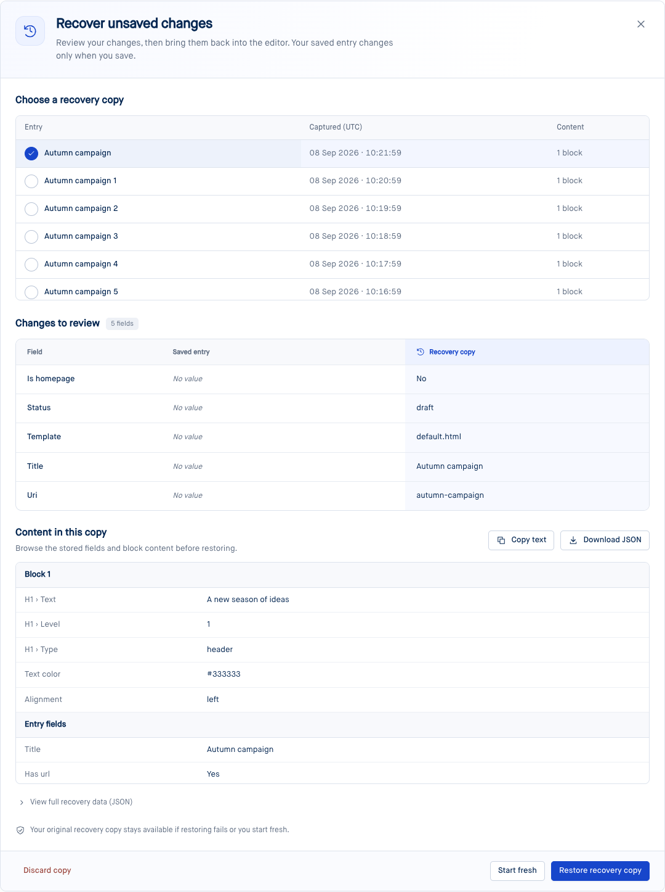
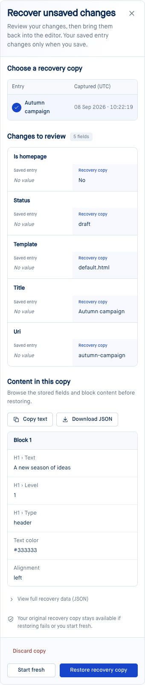

# Entry recovery copies

[Issue #2694](https://github.com/brandocms/brando/issues/2694) adds automatic recovery
copies to Blueprint forms, including entries that have never been saved. These
are mutable working copies in a separate table; autosaving does not publish
content or create revisions.

## Returning to unfinished work

After editing pauses, the form captures its fields, block tree, and completed
transformer rows. The status line acknowledges successful recovery storage.
Reopening the form offers recovery explicitly: the editor starts with its saved
content, and the user chooses which copy to restore. Copies are scoped to the
user, entry schema/ID, form, and tenant/environment. Separate editing sessions
keep separate stored copies. The chooser groups copies with equivalent content
and matching restore contracts into one choice, represented by the newest copy.
Copies that match known saved content are marked resolved when the editor opens
and when it saves. Saving settles matches against the previous baseline before
switching to the new one. This is durable state, so a later save cannot make old
saved content reappear as unsaved work. Original payloads remain in storage for
the resolved-copy retention period. Different unsaved content remains available,
including older work from another session; timestamps alone never resolve it.

Opening an entry can fill variable ownership, normalize positional sequence
values, and initialize default gallery overrides. Those changes alone do not
create a recovery copy. Comparison ignores only that initialization metadata;
text, explicit overrides, invalid values, asset selections, module contracts,
and list order still count as changes. Stored payloads and checksums stay intact.
An unchanged capture reports “No unsaved changes in this editor” instead of
claiming to have saved a recovery copy.

The review panel lists recovery copies in a bounded, scrollable table with entry
names, capture timestamps (including seconds), and block counts. Selected copies
have an explicit checkmark. A shaded recovery column compares changed scalar
fields with the saved entry, with readable empty and boolean values.

The content preview puts block text and variable values first, followed by entry
fields and related content. Copy text copies this readable view; Copy JSON and
Download JSON preserve the complete payload, including technical metadata. The
full-data disclosure and incompatible-block disclosures retain their open state
through LiveView patches using stable IDs and `JS.ignore_attributes("open")`.

Controls have compact desktop proportions, larger touch targets, and visible
keyboard focus. The footer groups restoration and clean-editor actions. On narrow
screens, each changed field becomes a stacked comparison with saved and recovered
values side by side, while the copy table keeps entry names and timestamps visible.

Recovery on a narrow screen

Restoring loads the copy into the editor. Normal Save still controls persistence,
validation, rendering, and publication. A successful save resolves the matching
generation and its unchanged equivalents. Dismissing or discarding a choice also
applies to its equivalents, so the same content does not reappear under another
timestamp. Generation and payload checks preserve concurrent changes. A tab
whose copy was closed stores subsequent edits in a new copy.

## Changed modules and unsuccessful restores

Recovery records module definitions alongside block content. Before casting a
copy, it checks the current definitions: removed/renamed fields, incompatible
types, missing modules, changed table definitions, and structural module settings
require review. Compatible additions receive current defaults. Restored blocks
use current module templates.

“Restore compatible content” loads the usable portion while retaining the
original copy and the excluded blocks' content for manual recovery. A changed
saved entry also requires explicit confirmation. Entry schema version changes
and unsupported payload formats fall back to inspection/export and a clean editor.

A restore attempt is recorded **before** applying the copy. After a failure,
reload does not reopen or retry it automatically. “Start fresh” (new entries) or
“Open saved version” dismisses recovery and opens a clean editor. The original
remains accessible through “Recovery copies”; subsequent edits use a new copy.

## Media recovery

Recovery keeps references to existing library assets. It does not duplicate image,
file, or video records, or overwrite their metadata. Galleries retain their owned
rows, order, deletions, captions, focal points, and playback overrides.

| Editor surface | Recovery coverage |
| --- | --- |
| Image, file, and video fields | New selections, replacements of saved assets, resets, save and reopen |
| Gallery fields | Mixed images/videos, drag ordering, loaded previews, deletions and owned row identity |
| Picture/video refs and gallery blocks | Media selection, mixed galleries, usage overrides and deletion |
| Media variables | Image/file block vars and image/file/video entry vars |

The media audit also fixes stale file previews after FK replacement/reset, missing
gallery previews after recovery, video field resets that previously only closed
the drawer, and upload folder drawers that failed to reopen after being closed.

## Implementation and installation

- Run `mix brando.upgrade`, then `mix ecto.migrate` in the consuming application.
  Migration **168** creates `public.entry_drafts`; its explicit scope separates
  tenant environments. `DraftPurger` runs daily through Oban. Active copies expire
  after 30 days; resolved/discarded copies after 7 days. Configure
  `:draft_retention_days` and `:resolved_draft_retention_days` under `:brando`.
- Capture uses a two-second debounce and a fifteen-second fallback. It reads
  block structure from the op store and overlays visible raw inputs, without
  blurring editors. Capture IDs and generations isolate replies from save/preview.
  Unchanged payloads avoid database writes; advisory locks prevent late captures
  from resurrecting resolved copies.
- Raw invalid values and completed media references survive capture. Password
  fields, file bytes, pending uploads, and rendered HTML caches are excluded.
  Unsaved metadata in separate asset drawers is outside the entry recovery copy.
- This is database-backed recovery. Edits made offline are not durable until
  acknowledged after reconnect. The form displays offline/storage failures and
  warns before closing or following a LiveView navigation link with unacknowledged
  edits. Browser-local offline persistence is outside this change.

The screenshots come from the real E2E application. Automated coverage includes
new and existing entries, focused block inputs, nested children, save-and-continue,
module changes, failed restore/reload/start-fresh, retained originals, navigation
protection, ownership, generation ordering, invalid values, and transformer assets.

Validation: 1,903 Elixir tests/doctests and 21 media/recovery browser scenarios passed, together
with the E2E consumer asset build, formatting, Blueprint Credo checks, and the
compile-connected dependency gate (no cycles).

The recovery card redesign was also verified with all 5 recovery browser scenarios,
37 existing draft/form recovery tests, desktop and 390px screenshots, a fresh E2E
consumer build, formatting, and the compile-connected dependency gate.

The recovery table and readable-preview update was verified with all 11 recovery
and media browser scenarios, 3 preview unit tests, the E2E consumer asset build,
formatting, and fresh desktop and 390px screenshots. The browser regression checks
keyboard selection, open-state retention across the real autosave interval,
clipboard content, and complete JSON downloads.

Content comparison and duplicate lifecycle handling are covered by 33 Elixir
tests and 13 recovery/media browser scenarios (four media scenarios passed on a
focused rerun after upload/timing failures). The legacy-data regression retains
14 original copies, verifies two capture/reload cycles create no new copies, and
then restores a real edit. Formatting and the compile-connected dependency gate
also pass.

Durable baseline resolution was verified with 35 Elixir tests and all 14
recovery/media browser scenarios. The new regression first reproduced the old
content returning after save, then passed two edit/save/reopen cycles with the
fix. The legacy gallery scenario also saves restored content and reopens it;
original payload retention, distinct older work, and newer tab edits have
storage-level coverage.
