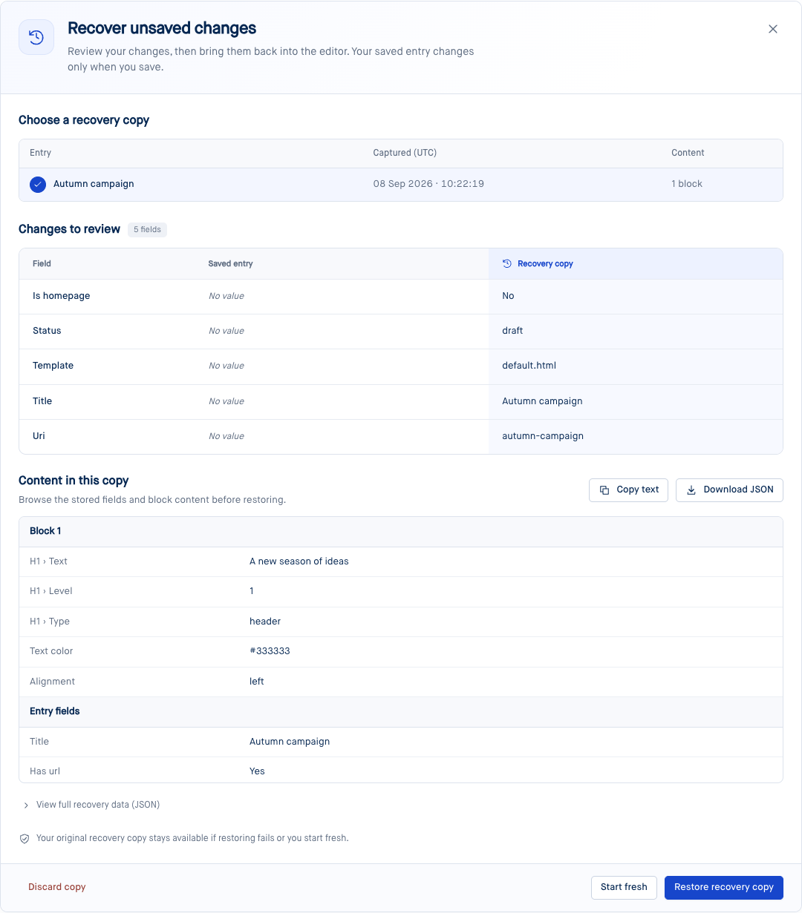
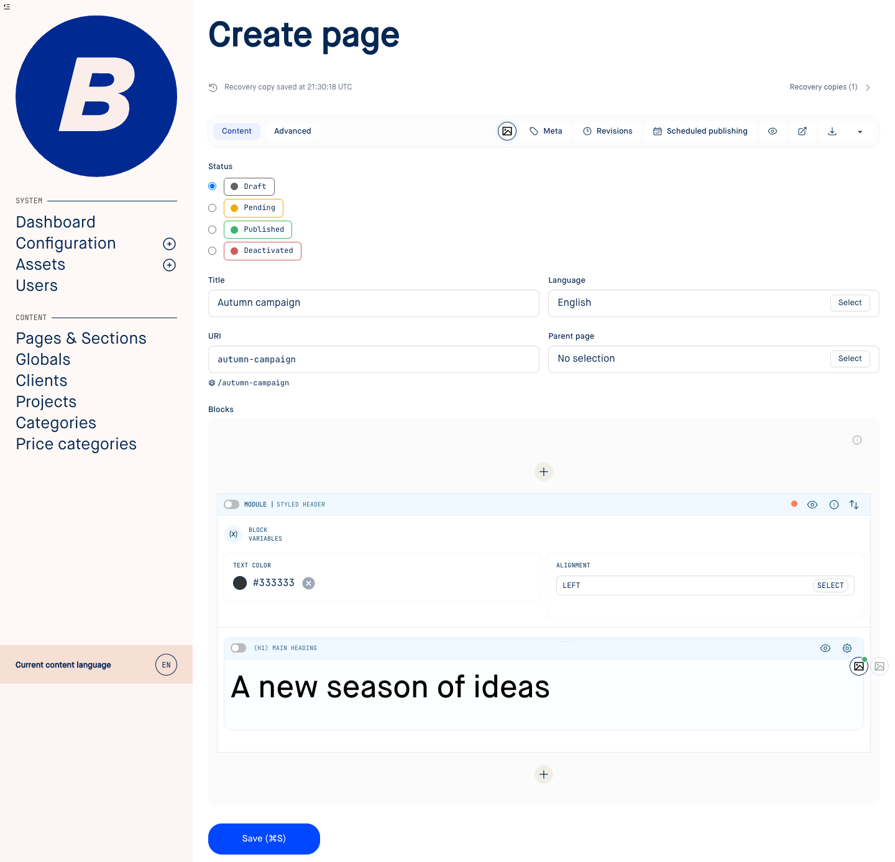
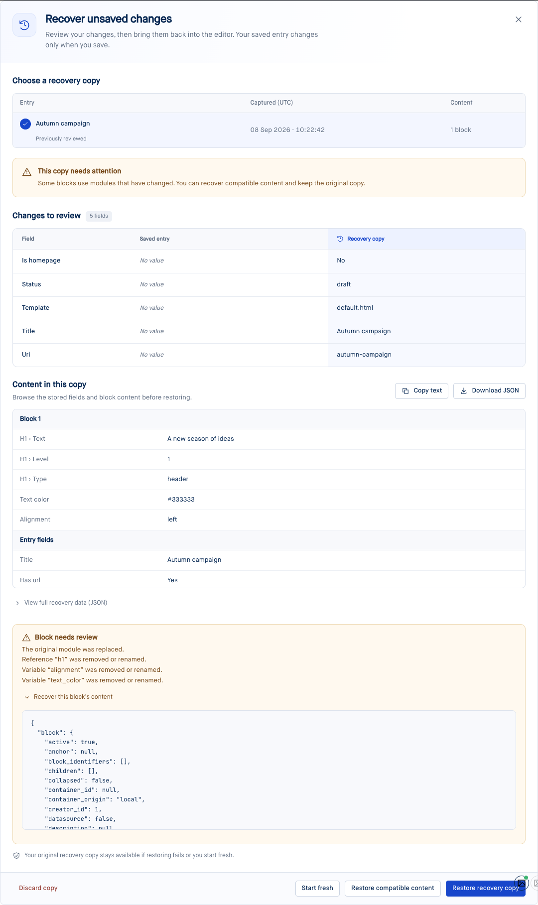
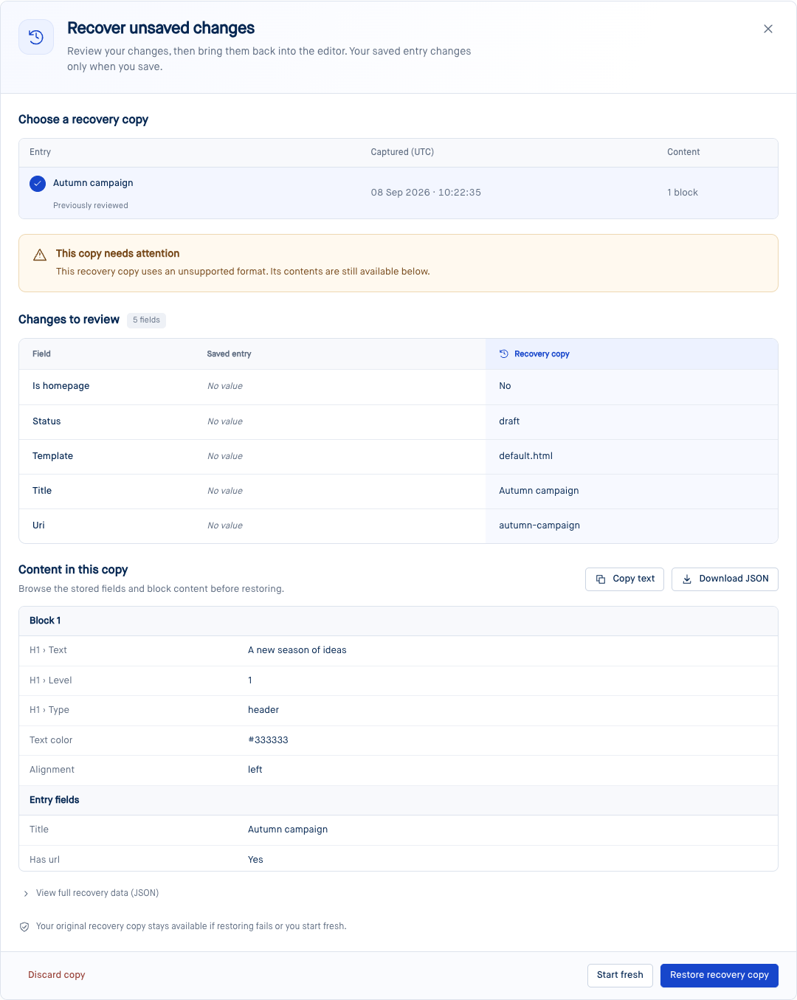
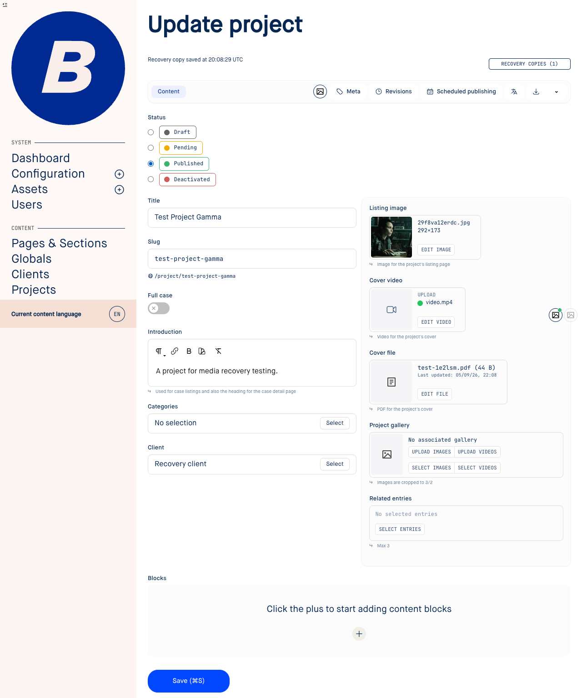
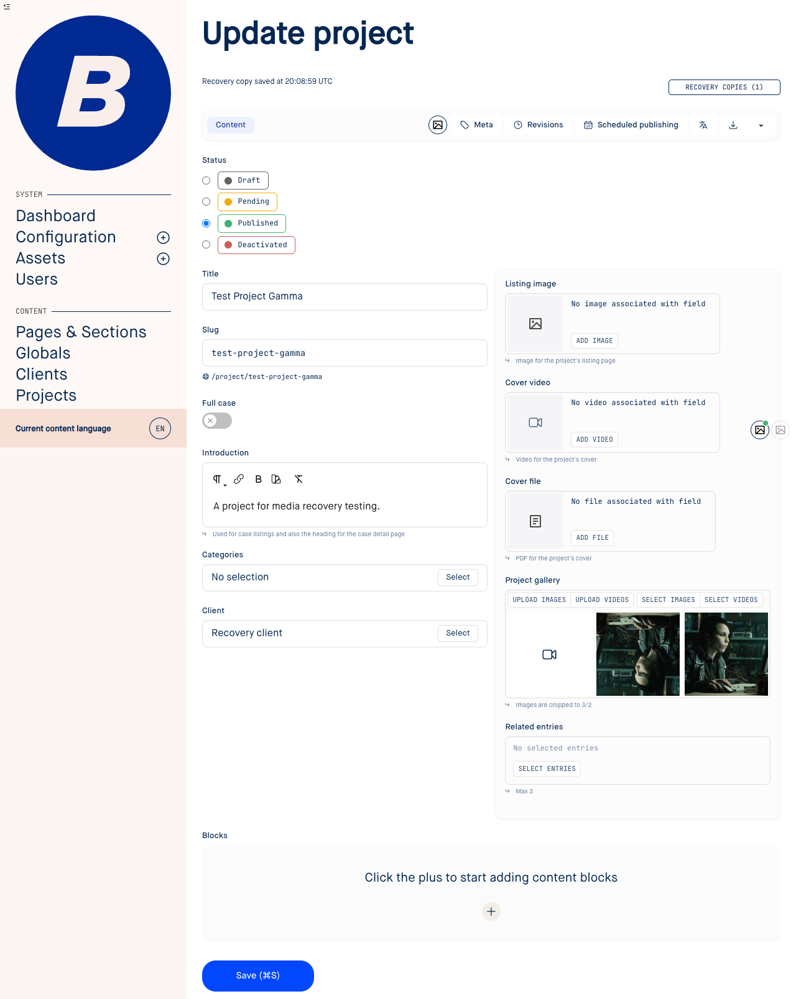
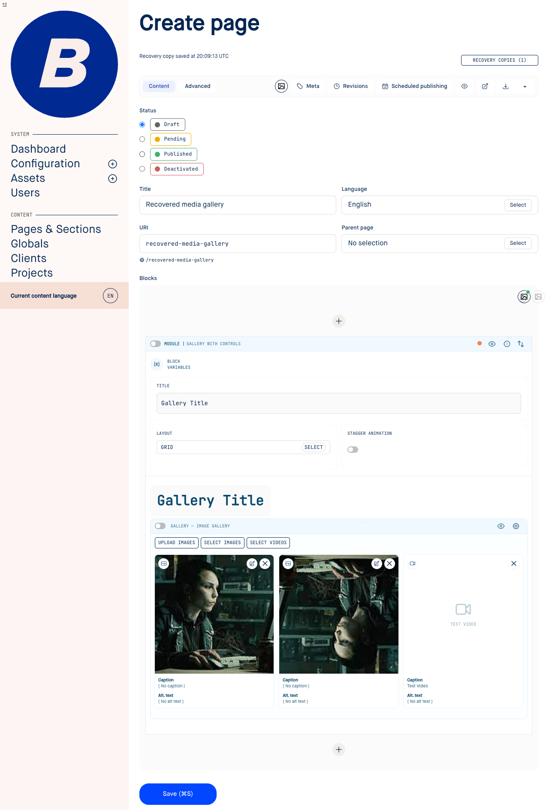
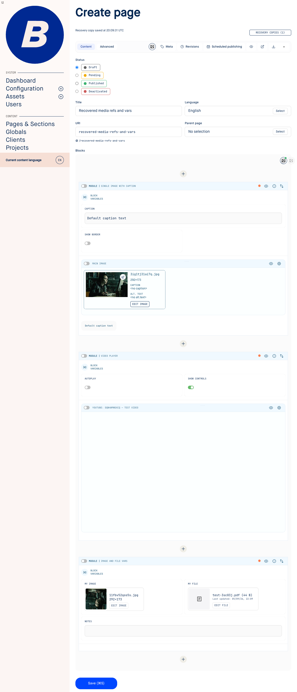

# Entry recovery copies

[Issue #2694](https://github.com/brandocms/brando/issues/2694) adds automatic recovery
copies to Blueprint forms, including entries that have never been saved. These
are mutable working copies in a separate table; autosaving does not publish
content or create revisions.

## Returning to unfinished work

After editing pauses, the form captures its fields, block tree, and completed
transformer rows. The status line acknowledges successful recovery storage.
Reopening the form offers recovery explicitly: the editor starts with its saved
content, and the user chooses which copy to restore. Copies are scoped to the
user, entry schema/ID, form, and tenant/environment. Separate editing sessions
keep separate copies.

The review panel compares changed scalar fields and offers a downloadable JSON
copy containing the complete recovery payload.

Restoring loads the copy into the editor. Normal Save still controls persistence,
validation, rendering, and publication. A successful save resolves the matching
generation; a newer copy or another session's work remains available.

## Changed modules and unsuccessful restores

Recovery records module definitions alongside block content. Before casting a
copy, it checks the current definitions: removed/renamed fields, incompatible
types, missing modules, changed table definitions, and structural module settings
require review. Compatible additions receive current defaults. Restored blocks
use current module templates.

“Restore compatible content” loads the usable portion while retaining the
original copy and the excluded blocks' content for manual recovery. A changed
saved entry also requires explicit confirmation. Entry schema version changes
and unsupported payload formats fall back to inspection/export and a clean editor.

A restore attempt is recorded **before** applying the copy. After a failure,
reload does not reopen or retry it automatically. “Start fresh” (new entries) or
“Open saved version” dismisses recovery and opens a clean editor. The original
remains accessible through “Recovery copies”; subsequent edits use a new copy.

## Media recovery

Recovery keeps references to existing library assets. It does not duplicate image,
file, or video records, or overwrite their metadata. Galleries retain their owned
rows, order, deletions, captions, focal points, and playback overrides.

| Editor surface | Recovery coverage |
| --- | --- |
| Image, file, and video fields | New selections, replacements of saved assets, resets, save and reopen |
| Gallery fields | Mixed images/videos, drag ordering, loaded previews, deletions and owned row identity |
| Picture/video refs and gallery blocks | Media selection, mixed galleries, usage overrides and deletion |
| Media variables | Image/file block vars and image/file/video entry vars |

The media audit also fixes stale file previews after FK replacement/reset, missing
gallery previews after recovery, video field resets that previously only closed
the drawer, and upload folder drawers that failed to reopen after being closed.

## Implementation and installation

- Run `mix brando.upgrade`, then `mix ecto.migrate` in the consuming application.
  Migration **168** creates `public.entry_drafts`; its explicit scope separates
  tenant environments. `DraftPurger` runs daily through Oban. Active copies expire
  after 30 days; resolved/discarded copies after 7 days. Configure
  `:draft_retention_days` and `:resolved_draft_retention_days` under `:brando`.
- Capture uses a two-second debounce and a fifteen-second fallback. It reads
  block structure from the op store and overlays visible raw inputs, without
  blurring editors. Capture IDs and generations isolate replies from save/preview.
  Unchanged payloads avoid database writes; advisory locks prevent late captures
  from resurrecting resolved copies.
- Raw invalid values and completed media references survive capture. Password
  fields, file bytes, pending uploads, and rendered HTML caches are excluded.
  Unsaved metadata in separate asset drawers is outside the entry recovery copy.
- This is database-backed recovery. Edits made offline are not durable until
  acknowledged after reconnect. The form displays offline/storage failures and
  warns before closing or following a LiveView navigation link with unacknowledged
  edits. Browser-local offline persistence is outside this change.

The screenshots come from the real E2E application. Automated coverage includes
new and existing entries, focused block inputs, nested children, save-and-continue,
module changes, failed restore/reload/start-fresh, retained originals, navigation
protection, ownership, generation ordering, invalid values, and transformer assets.

Validation: 1,903 Elixir tests/doctests and 21 media/recovery browser scenarios passed, together
with the E2E consumer asset build, formatting, Blueprint Credo checks, and the
compile-connected dependency gate (no cycles).
