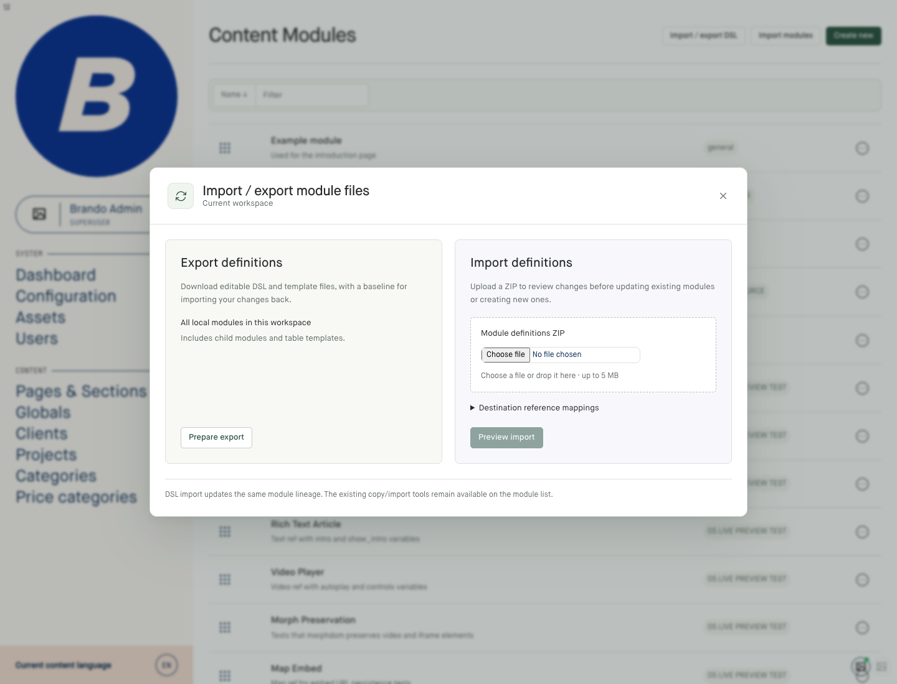
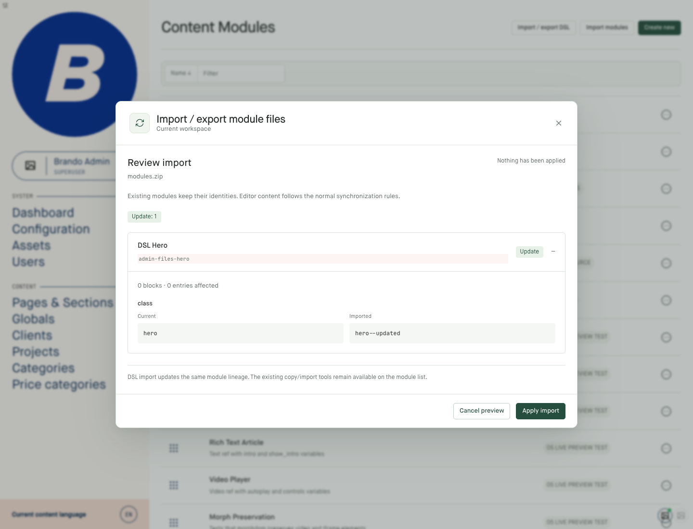
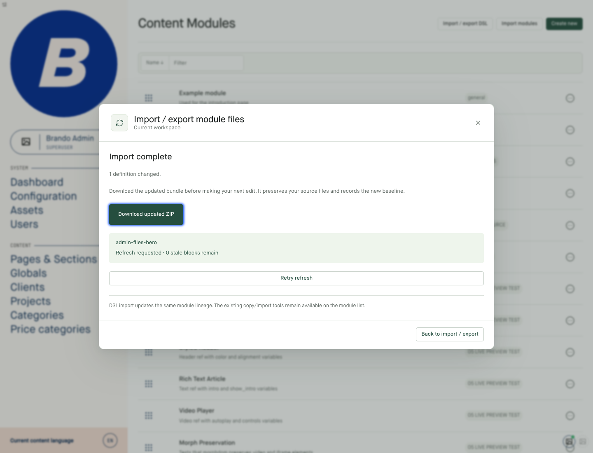
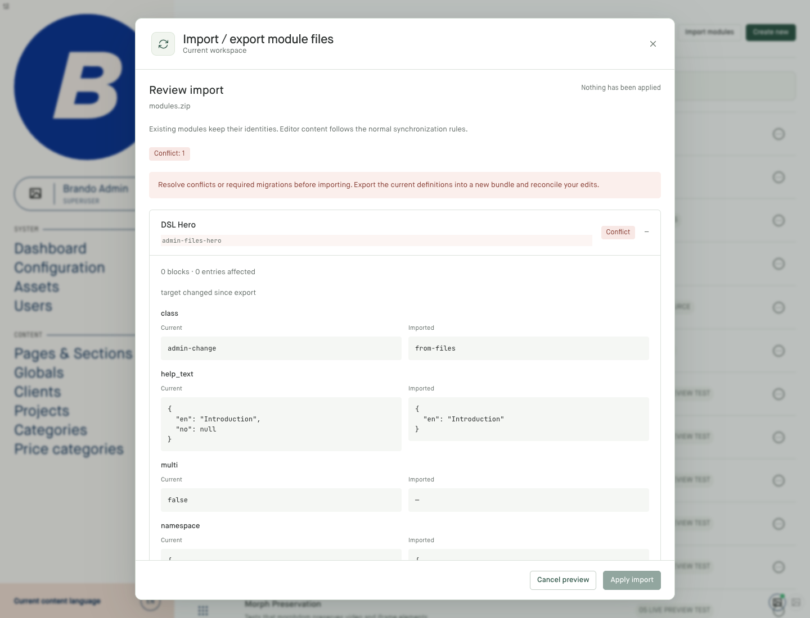
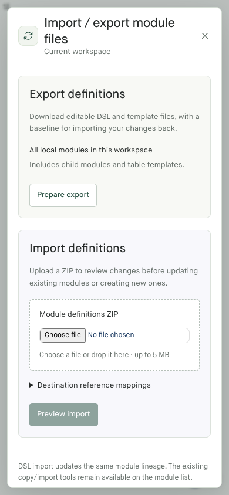

# Module definition files in the admin

Open **Content Modules → Import / export DSL**. These screenshots show the real
E2E application at 1440px desktop and 390px mobile widths.

## Export and import

Prepare and download a ZIP of all local modules, or select rows and choose
**Export DSL files**. Upload an edited bundle to preview it before applying.

## Review changes

Expand a definition to compare current and imported fields. Preview and cancel
leave definitions untouched.

## Download the updated baseline

After applying, download the updated ZIP before editing again. It retains the
uploaded source files and records the new baseline.

## Conflicts

A definition changed in another admin tab cannot be overwritten by an old
preview. Replanning shows the conflict and disables **Apply import**.

## Mobile

The export and import cards stack on narrow screens.

Captured by `tests/configuration/module-files.spec.js`. See the
[module definitions guide](../../guides/module_definitions.md) for DSL syntax,
reference mappings, CLI commands, permissions and scope limitations.
